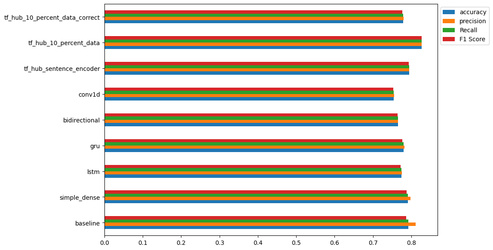
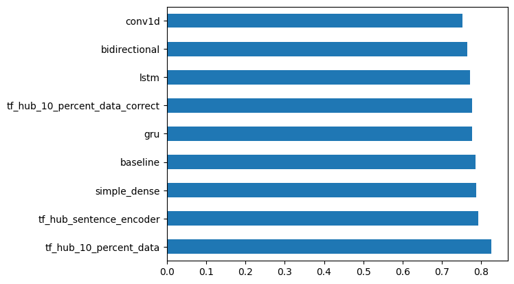
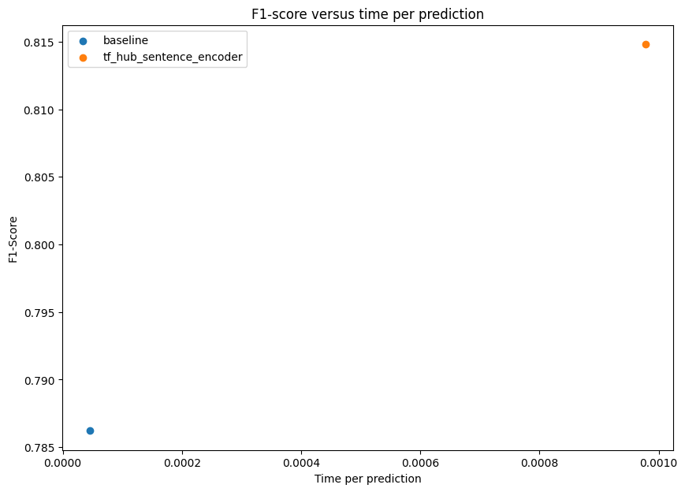

# Introduction to NLP Fundamentals in TensorFlow


```python
!nvidia-smi -L
```

    /bin/bash: nvidia-smi: command not found


```python
## Get helper functions
```


```python
!wget https://raw.githubusercontent.com/mrdbourke/tensorflow-deep-learning/main/extras/helper_functions.py

# Import series of helper functions 
from helper_functions import unzip_data, create_tensorboard_callback, plot_loss_curves, compare_historys
```

    --2023-06-12 15:51:32--  https://raw.githubusercontent.com/mrdbourke/tensorflow-deep-learning/main/extras/helper_functions.py
    Resolving raw.githubusercontent.com (raw.githubusercontent.com)... 185.199.108.133, 185.199.109.133, 185.199.110.133, ...
    Connecting to raw.githubusercontent.com (raw.githubusercontent.com)|185.199.108.133|:443... connected.
    HTTP request sent, awaiting response... 200 OK
    Length: 10246 (10K) [text/plain]
    Saving to: ‘helper_functions.py’
    
    helper_functions.py 100%[===================>]  10.01K  --.-KB/s    in 0s      
    
    2023-06-12 15:51:32 (69.7 MB/s) - ‘helper_functions.py’ saved [10246/10246]
    


## Get Text data


```python
!wget https://storage.googleapis.com/ztm_tf_course/nlp_getting_started.zip

#Unzip data 
unzip_data('nlp_getting_started.zip')
```

    --2023-06-12 15:51:37--  https://storage.googleapis.com/ztm_tf_course/nlp_getting_started.zip
    Resolving storage.googleapis.com (storage.googleapis.com)... 172.253.63.128, 142.250.31.128, 142.251.111.128, ...
    Connecting to storage.googleapis.com (storage.googleapis.com)|172.253.63.128|:443... connected.
    HTTP request sent, awaiting response... 200 OK
    Length: 607343 (593K) [application/zip]
    Saving to: ‘nlp_getting_started.zip’
    
    nlp_getting_started 100%[===================>] 593.11K  --.-KB/s    in 0.006s  
    
    2023-06-12 15:51:37 (101 MB/s) - ‘nlp_getting_started.zip’ saved [607343/607343]
    


## Visualizing a text dataset


```python
import pandas as pd 
train_df = pd.read_csv('train.csv')
test_df = pd.read_csv('test.csv')
train_df.head()
```


  <div id="df-a40c9984-a229-4ad8-a824-40c04803bb93">
    <div class="colab-df-container">
      <div>
<style scoped>
    .dataframe tbody tr th:only-of-type {
        vertical-align: middle;
    }

    .dataframe tbody tr th {
        vertical-align: top;
    }

    .dataframe thead th {
        text-align: right;
    }
</style>
<table border="1" class="dataframe">
  <thead>
    <tr style="text-align: right;">
      <th></th>
      <th>id</th>
      <th>keyword</th>
      <th>location</th>
      <th>text</th>
      <th>target</th>
    </tr>
  </thead>
  <tbody>
    <tr>
      <th>0</th>
      <td>1</td>
      <td>NaN</td>
      <td>NaN</td>
      <td>Our Deeds are the Reason of this #earthquake M...</td>
      <td>1</td>
    </tr>
    <tr>
      <th>1</th>
      <td>4</td>
      <td>NaN</td>
      <td>NaN</td>
      <td>Forest fire near La Ronge Sask. Canada</td>
      <td>1</td>
    </tr>
    <tr>
      <th>2</th>
      <td>5</td>
      <td>NaN</td>
      <td>NaN</td>
      <td>All residents asked to 'shelter in place' are ...</td>
      <td>1</td>
    </tr>
    <tr>
      <th>3</th>
      <td>6</td>
      <td>NaN</td>
      <td>NaN</td>
      <td>13,000 people receive #wildfires evacuation or...</td>
      <td>1</td>
    </tr>
    <tr>
      <th>4</th>
      <td>7</td>
      <td>NaN</td>
      <td>NaN</td>
      <td>Just got sent this photo from Ruby #Alaska as ...</td>
      <td>1</td>
    </tr>
  </tbody>
</table>
</div>
      <button class="colab-df-convert" onclick="convertToInteractive('df-a40c9984-a229-4ad8-a824-40c04803bb93')"
              title="Convert this dataframe to an interactive table."
              style="display:none;">

  <svg xmlns="http://www.w3.org/2000/svg" height="24px"viewBox="0 0 24 24"
       width="24px">
    <path d="M0 0h24v24H0V0z" fill="none"/>
    <path d="M18.56 5.44l.94 2.06.94-2.06 2.06-.94-2.06-.94-.94-2.06-.94 2.06-2.06.94zm-11 1L8.5 8.5l.94-2.06 2.06-.94-2.06-.94L8.5 2.5l-.94 2.06-2.06.94zm10 10l.94 2.06.94-2.06 2.06-.94-2.06-.94-.94-2.06-.94 2.06-2.06.94z"/><path d="M17.41 7.96l-1.37-1.37c-.4-.4-.92-.59-1.43-.59-.52 0-1.04.2-1.43.59L10.3 9.45l-7.72 7.72c-.78.78-.78 2.05 0 2.83L4 21.41c.39.39.9.59 1.41.59.51 0 1.02-.2 1.41-.59l7.78-7.78 2.81-2.81c.8-.78.8-2.07 0-2.86zM5.41 20L4 18.59l7.72-7.72 1.47 1.35L5.41 20z"/>
  </svg>
      </button>

  <style>
    .colab-df-container {
      display:flex;
      flex-wrap:wrap;
      gap: 12px;
    }

    .colab-df-convert {
      background-color: #E8F0FE;
      border: none;
      border-radius: 50%;
      cursor: pointer;
      display: none;
      fill: #1967D2;
      height: 32px;
      padding: 0 0 0 0;
      width: 32px;
    }

    .colab-df-convert:hover {
      background-color: #E2EBFA;
      box-shadow: 0px 1px 2px rgba(60, 64, 67, 0.3), 0px 1px 3px 1px rgba(60, 64, 67, 0.15);
      fill: #174EA6;
    }

    [theme=dark] .colab-df-convert {
      background-color: #3B4455;
      fill: #D2E3FC;
    }

    [theme=dark] .colab-df-convert:hover {
      background-color: #434B5C;
      box-shadow: 0px 1px 3px 1px rgba(0, 0, 0, 0.15);
      filter: drop-shadow(0px 1px 2px rgba(0, 0, 0, 0.3));
      fill: #FFFFFF;
    }
  </style>

      <script>
        const buttonEl =
          document.querySelector('#df-a40c9984-a229-4ad8-a824-40c04803bb93 button.colab-df-convert');
        buttonEl.style.display =
          google.colab.kernel.accessAllowed ? 'block' : 'none';

        async function convertToInteractive(key) {
          const element = document.querySelector('#df-a40c9984-a229-4ad8-a824-40c04803bb93');
          const dataTable =
            await google.colab.kernel.invokeFunction('convertToInteractive',
                                                     [key], {});
          if (!dataTable) return;

          const docLinkHtml = 'Like what you see? Visit the ' +
            '<a target="_blank" href=https://colab.research.google.com/notebooks/data_table.ipynb>data table notebook</a>'
            + ' to learn more about interactive tables.';
          element.innerHTML = '';
          dataTable['output_type'] = 'display_data';
          await google.colab.output.renderOutput(dataTable, element);
          const docLink = document.createElement('div');
          docLink.innerHTML = docLinkHtml;
          element.appendChild(docLink);
        }
      </script>
    </div>
  </div>


```python
train_df['text'][0]
```


    'Our Deeds are the Reason of this #earthquake May ALLAH Forgive us all'


```python
# Shuffle training dataframe 
train_df_shuffled = train_df.sample(frac=1, random_state=42)
train_df_shuffled.head()
```


  <div id="df-11e90b07-6ddb-4060-be3d-d5342cb925e7">
    <div class="colab-df-container">
      <div>
<style scoped>
    .dataframe tbody tr th:only-of-type {
        vertical-align: middle;
    }

    .dataframe tbody tr th {
        vertical-align: top;
    }

    .dataframe thead th {
        text-align: right;
    }
</style>
<table border="1" class="dataframe">
  <thead>
    <tr style="text-align: right;">
      <th></th>
      <th>id</th>
      <th>keyword</th>
      <th>location</th>
      <th>text</th>
      <th>target</th>
    </tr>
  </thead>
  <tbody>
    <tr>
      <th>2644</th>
      <td>3796</td>
      <td>destruction</td>
      <td>NaN</td>
      <td>So you have a new weapon that can cause un-ima...</td>
      <td>1</td>
    </tr>
    <tr>
      <th>2227</th>
      <td>3185</td>
      <td>deluge</td>
      <td>NaN</td>
      <td>The f$&amp;amp;@ing things I do for #GISHWHES Just...</td>
      <td>0</td>
    </tr>
    <tr>
      <th>5448</th>
      <td>7769</td>
      <td>police</td>
      <td>UK</td>
      <td>DT @georgegalloway: RT @Galloway4Mayor: ‰ÛÏThe...</td>
      <td>1</td>
    </tr>
    <tr>
      <th>132</th>
      <td>191</td>
      <td>aftershock</td>
      <td>NaN</td>
      <td>Aftershock back to school kick off was great. ...</td>
      <td>0</td>
    </tr>
    <tr>
      <th>6845</th>
      <td>9810</td>
      <td>trauma</td>
      <td>Montgomery County, MD</td>
      <td>in response to trauma Children of Addicts deve...</td>
      <td>0</td>
    </tr>
  </tbody>
</table>
</div>
      <button class="colab-df-convert" onclick="convertToInteractive('df-11e90b07-6ddb-4060-be3d-d5342cb925e7')"
              title="Convert this dataframe to an interactive table."
              style="display:none;">

  <svg xmlns="http://www.w3.org/2000/svg" height="24px"viewBox="0 0 24 24"
       width="24px">
    <path d="M0 0h24v24H0V0z" fill="none"/>
    <path d="M18.56 5.44l.94 2.06.94-2.06 2.06-.94-2.06-.94-.94-2.06-.94 2.06-2.06.94zm-11 1L8.5 8.5l.94-2.06 2.06-.94-2.06-.94L8.5 2.5l-.94 2.06-2.06.94zm10 10l.94 2.06.94-2.06 2.06-.94-2.06-.94-.94-2.06-.94 2.06-2.06.94z"/><path d="M17.41 7.96l-1.37-1.37c-.4-.4-.92-.59-1.43-.59-.52 0-1.04.2-1.43.59L10.3 9.45l-7.72 7.72c-.78.78-.78 2.05 0 2.83L4 21.41c.39.39.9.59 1.41.59.51 0 1.02-.2 1.41-.59l7.78-7.78 2.81-2.81c.8-.78.8-2.07 0-2.86zM5.41 20L4 18.59l7.72-7.72 1.47 1.35L5.41 20z"/>
  </svg>
      </button>

  <style>
    .colab-df-container {
      display:flex;
      flex-wrap:wrap;
      gap: 12px;
    }

    .colab-df-convert {
      background-color: #E8F0FE;
      border: none;
      border-radius: 50%;
      cursor: pointer;
      display: none;
      fill: #1967D2;
      height: 32px;
      padding: 0 0 0 0;
      width: 32px;
    }

    .colab-df-convert:hover {
      background-color: #E2EBFA;
      box-shadow: 0px 1px 2px rgba(60, 64, 67, 0.3), 0px 1px 3px 1px rgba(60, 64, 67, 0.15);
      fill: #174EA6;
    }

    [theme=dark] .colab-df-convert {
      background-color: #3B4455;
      fill: #D2E3FC;
    }

    [theme=dark] .colab-df-convert:hover {
      background-color: #434B5C;
      box-shadow: 0px 1px 3px 1px rgba(0, 0, 0, 0.15);
      filter: drop-shadow(0px 1px 2px rgba(0, 0, 0, 0.3));
      fill: #FFFFFF;
    }
  </style>

      <script>
        const buttonEl =
          document.querySelector('#df-11e90b07-6ddb-4060-be3d-d5342cb925e7 button.colab-df-convert');
        buttonEl.style.display =
          google.colab.kernel.accessAllowed ? 'block' : 'none';

        async function convertToInteractive(key) {
          const element = document.querySelector('#df-11e90b07-6ddb-4060-be3d-d5342cb925e7');
          const dataTable =
            await google.colab.kernel.invokeFunction('convertToInteractive',
                                                     [key], {});
          if (!dataTable) return;

          const docLinkHtml = 'Like what you see? Visit the ' +
            '<a target="_blank" href=https://colab.research.google.com/notebooks/data_table.ipynb>data table notebook</a>'
            + ' to learn more about interactive tables.';
          element.innerHTML = '';
          dataTable['output_type'] = 'display_data';
          await google.colab.output.renderOutput(dataTable, element);
          const docLink = document.createElement('div');
          docLink.innerHTML = docLinkHtml;
          element.appendChild(docLink);
        }
      </script>
    </div>
  </div>


```python
# What does the test_data look like 
test_df.head()
```


  <div id="df-a5c9b2e6-1a8b-47d1-896d-c19f108ac5a2">
    <div class="colab-df-container">
      <div>
<style scoped>
    .dataframe tbody tr th:only-of-type {
        vertical-align: middle;
    }

    .dataframe tbody tr th {
        vertical-align: top;
    }

    .dataframe thead th {
        text-align: right;
    }
</style>
<table border="1" class="dataframe">
  <thead>
    <tr style="text-align: right;">
      <th></th>
      <th>id</th>
      <th>keyword</th>
      <th>location</th>
      <th>text</th>
    </tr>
  </thead>
  <tbody>
    <tr>
      <th>0</th>
      <td>0</td>
      <td>NaN</td>
      <td>NaN</td>
      <td>Just happened a terrible car crash</td>
    </tr>
    <tr>
      <th>1</th>
      <td>2</td>
      <td>NaN</td>
      <td>NaN</td>
      <td>Heard about #earthquake is different cities, s...</td>
    </tr>
    <tr>
      <th>2</th>
      <td>3</td>
      <td>NaN</td>
      <td>NaN</td>
      <td>there is a forest fire at spot pond, geese are...</td>
    </tr>
    <tr>
      <th>3</th>
      <td>9</td>
      <td>NaN</td>
      <td>NaN</td>
      <td>Apocalypse lighting. #Spokane #wildfires</td>
    </tr>
    <tr>
      <th>4</th>
      <td>11</td>
      <td>NaN</td>
      <td>NaN</td>
      <td>Typhoon Soudelor kills 28 in China and Taiwan</td>
    </tr>
  </tbody>
</table>
</div>
      <button class="colab-df-convert" onclick="convertToInteractive('df-a5c9b2e6-1a8b-47d1-896d-c19f108ac5a2')"
              title="Convert this dataframe to an interactive table."
              style="display:none;">

  <svg xmlns="http://www.w3.org/2000/svg" height="24px"viewBox="0 0 24 24"
       width="24px">
    <path d="M0 0h24v24H0V0z" fill="none"/>
    <path d="M18.56 5.44l.94 2.06.94-2.06 2.06-.94-2.06-.94-.94-2.06-.94 2.06-2.06.94zm-11 1L8.5 8.5l.94-2.06 2.06-.94-2.06-.94L8.5 2.5l-.94 2.06-2.06.94zm10 10l.94 2.06.94-2.06 2.06-.94-2.06-.94-.94-2.06-.94 2.06-2.06.94z"/><path d="M17.41 7.96l-1.37-1.37c-.4-.4-.92-.59-1.43-.59-.52 0-1.04.2-1.43.59L10.3 9.45l-7.72 7.72c-.78.78-.78 2.05 0 2.83L4 21.41c.39.39.9.59 1.41.59.51 0 1.02-.2 1.41-.59l7.78-7.78 2.81-2.81c.8-.78.8-2.07 0-2.86zM5.41 20L4 18.59l7.72-7.72 1.47 1.35L5.41 20z"/>
  </svg>
      </button>

  <style>
    .colab-df-container {
      display:flex;
      flex-wrap:wrap;
      gap: 12px;
    }

    .colab-df-convert {
      background-color: #E8F0FE;
      border: none;
      border-radius: 50%;
      cursor: pointer;
      display: none;
      fill: #1967D2;
      height: 32px;
      padding: 0 0 0 0;
      width: 32px;
    }

    .colab-df-convert:hover {
      background-color: #E2EBFA;
      box-shadow: 0px 1px 2px rgba(60, 64, 67, 0.3), 0px 1px 3px 1px rgba(60, 64, 67, 0.15);
      fill: #174EA6;
    }

    [theme=dark] .colab-df-convert {
      background-color: #3B4455;
      fill: #D2E3FC;
    }

    [theme=dark] .colab-df-convert:hover {
      background-color: #434B5C;
      box-shadow: 0px 1px 3px 1px rgba(0, 0, 0, 0.15);
      filter: drop-shadow(0px 1px 2px rgba(0, 0, 0, 0.3));
      fill: #FFFFFF;
    }
  </style>

      <script>
        const buttonEl =
          document.querySelector('#df-a5c9b2e6-1a8b-47d1-896d-c19f108ac5a2 button.colab-df-convert');
        buttonEl.style.display =
          google.colab.kernel.accessAllowed ? 'block' : 'none';

        async function convertToInteractive(key) {
          const element = document.querySelector('#df-a5c9b2e6-1a8b-47d1-896d-c19f108ac5a2');
          const dataTable =
            await google.colab.kernel.invokeFunction('convertToInteractive',
                                                     [key], {});
          if (!dataTable) return;

          const docLinkHtml = 'Like what you see? Visit the ' +
            '<a target="_blank" href=https://colab.research.google.com/notebooks/data_table.ipynb>data table notebook</a>'
            + ' to learn more about interactive tables.';
          element.innerHTML = '';
          dataTable['output_type'] = 'display_data';
          await google.colab.output.renderOutput(dataTable, element);
          const docLink = document.createElement('div');
          docLink.innerHTML = docLinkHtml;
          element.appendChild(docLink);
        }
      </script>
    </div>
  </div>


```python
train_df.target.value_counts()
```


    0    4342
    1    3271
    Name: target, dtype: int64


```python
# How many total samples 
len(train_df), len(test_df)
```


    (7613, 3263)


```python
# Lets visualize some random training samples 
import random 
random_index = random.randint(0, len(train_df)-5)
for row in train_df_shuffled[['text', 'target']][random_index:random_index+5].itertuples():
  _, text, target = row
  print(f'Target: {target}', '(real disaster)' if target>0 else '(not real disaster)')
  print(f'Text: \n{text}')
  print("---\n")
```

    Target: 1 (real disaster)
    Text: 
    @Dirk_NoMissSki yea but if someone faints why are they panicking?.. thats basic stuff ??
    ---
    
    Target: 1 (real disaster)
    Text: 
    @zaynmaIikist listen to hurricane
    ---
    
    Target: 1 (real disaster)
    Text: 
    See the 16yr old PKK suicide bomber who detonated bomb in Turkey Army trench‰Û_ http://t.co/ZdiEodWbog via @MsOreo_ http://t.co/V6nyLVdPeD
    ---
    
    Target: 1 (real disaster)
    Text: 
    @xDescry I was wrong to call it trusty actually.. considering it spontaneously collapsed on me that's not very trusty.
    ---
    
    Target: 0 (not real disaster)
    Text: 
    #Denver CO #Insurance #Job: Claims Property Field Adjuster Catastrophe Safeco ‰ÛÒ USA at Liberty Mutual Insurance http://t.co/3k42MJVqCA
    ---
    


### Split data into training and validation sets


```python
from sklearn.model_selection import train_test_split
```


```python
# Use train_test_split to split data into training data and validation sets 
train_sentences, val_sentences, train_labels, val_labels = train_test_split(train_df_shuffled['text'].to_numpy(),
                                                                           train_df_shuffled['target'].to_numpy(),
                                                                            test_size=0.1,
                                                                            random_state=42)
```


```python
# Check the lengths
len(train_sentences), len(train_labels), len(val_sentences), len(val_labels)
```


    (6851, 6851, 762, 762)


```python
# Check the first 10 samples 
train_sentences[:10], train_labels[:10]
```


    (array(['@mogacola @zamtriossu i screamed after hitting tweet',
            'Imagine getting flattened by Kurt Zouma',
            '@Gurmeetramrahim #MSGDoing111WelfareWorks Green S welfare force ke appx 65000 members har time disaster victim ki help ke liye tyar hai....',
            "@shakjn @C7 @Magnums im shaking in fear he's gonna hack the planet",
            'Somehow find you and I collide http://t.co/Ee8RpOahPk',
            '@EvaHanderek @MarleyKnysh great times until the bus driver held us hostage in the mall parking lot lmfao',
            'destroy the free fandom honestly',
            'Weapons stolen from National Guard Armory in New Albany still missing #Gunsense http://t.co/lKNU8902JE',
            '@wfaaweather Pete when will the heat wave pass? Is it really going to be mid month? Frisco Boy Scouts have a canoe trip in Okla.',
            'Patient-reported outcomes in long-term survivors of metastatic colorectal cancer - British Journal of Surgery http://t.co/5Yl4DC1Tqt'],
           dtype=object),
     array([0, 0, 1, 0, 0, 1, 1, 0, 1, 1]))


## Convert text to numbers 

Tokenization vs Embedding 

`Tokenization`

I love tensorflow --> 0,1,2; [[1,0,0],
                              [0,1,0],
                              [0,0,1]]

`Embedding`

Richer representation of relationships between tokens (can limit size + can be learned) 

When dealing with a text problem, one of the first things you'll have to do before you can build a model is to convert your text to number 

There are a few ways to do this, namely:
* Tokenization - direct mapping of token (a token could be a word or a character) to a number 
* Embedding - create a matrix of feature vector for each token (the size of the feature vector can be defined and this embedding can be learned) 

### Text vectorization (tokenization)


```python
train_sentences[:5]
```


    array(['@mogacola @zamtriossu i screamed after hitting tweet',
           'Imagine getting flattened by Kurt Zouma',
           '@Gurmeetramrahim #MSGDoing111WelfareWorks Green S welfare force ke appx 65000 members har time disaster victim ki help ke liye tyar hai....',
           "@shakjn @C7 @Magnums im shaking in fear he's gonna hack the planet",
           'Somehow find you and I collide http://t.co/Ee8RpOahPk'],
          dtype=object)


```python
import tensorflow as tf 
from tensorflow.keras.layers import TextVectorization

# Use the default TextVectorization parameters
text_vectorizer = TextVectorization(max_tokens=None, #how many words in the vocabulary
                                    standardize='lower_and_strip_punctuation',
                                    split='whitespace',
                                    ngrams=None,
                                    output_mode='int',
                                    output_sequence_length=None,
                                    pad_to_max_tokens=False
                                    )
```


```python
# Find the average number of tokens(words) in the training tweets
round(sum([len(i.split()) for i in train_sentences])/len(train_sentences))
```


    15


```python
# Setup text vectorization variables 
max_vocab_length = 10000 
max_length = 15

text_vectorizer = TextVectorization(max_tokens=max_vocab_length,
                                       output_mode = 'int',
                                       output_sequence_length=max_length)
```


```python
# Fit the text vectorizer to the training text 
text_vectorizer.adapt(train_sentences)
```


```python
# Create a sample sentence and tokenize it 
sample_sentence = "There's a flood in my steet!"
text_vectorizer([sample_sentence])
```


    <tf.Tensor: shape=(1, 15), dtype=int64, numpy=
    array([[264,   3, 232,   4,  13,   1,   0,   0,   0,   0,   0,   0,   0,
              0,   0]])>


```python
# Choose a random sentence from the training dataset and tokenize it 
random_sentence = random.choice(train_sentences)
print(f'Original Text:\n {random_sentence}\
      \n\nVectorized version: ')
text_vectorizer([random_sentence])
```

    Original Text:
     600 passengers abandoned at LRT station during Tuesday's hailstorm http://t.co/vgF41IuPkn #yyc #yycstorm #abstorm      
    
    Vectorized version: 


    <tf.Tensor: shape=(1, 15), dtype=int64, numpy=
    array([[1232, 1000, 1441,   17, 3662, 2678,  246, 7318,  818,    1, 1446,
            4208, 1724,    0,    0]])>


```python
# Get the unique words in the vocabulary
words_in_vocab = text_vectorizer.get_vocabulary()
top_5_words = words_in_vocab[:5]
bottom_5_words = words_in_vocab[-5:]
print(f'Number of words in vocab: {len(words_in_vocab)}')
print(f'5 most common words: {(top_5_words)}')
print(f'5 least common words: {(bottom_5_words)}')
```

    Number of words in vocab: 10000
    5 most common words: ['', '[UNK]', 'the', 'a', 'in']
    5 least common words: ['pages', 'paeds', 'pads', 'padres', 'paddytomlinson1']


### Creating an Embedding using an Embedding Layer

To make our embedding, we're going to use Tensorflows embedding layer

The parameters we care about the most for our embedding layer: 
* `input_dim` = the size of our vocabulary
* `output_dim` = the size of the output embedding vector, for example, a value of 100 would mean each token gets represented by a vecotr 100 long
* `input_length` = length of the sequences being passed to the embedding layer 


```python
from tensorflow.keras import layers 
embedding = layers.Embedding(input_dim=max_vocab_length,
                             output_dim=128,
                             input_length=max_length,
                            embeddings_initializer='uniform')
embedding
```


    <keras.layers.core.embedding.Embedding at 0x7f1091e02410>


```python
# Get a random sentence from the training set
random_sentence = random.choice(train_sentences)
print(f'Original text: \n {random_sentence}\
\n\nEmbedded Version:')

# Embed the random sentence (turn it into dense vectors of fixed size)
sample_embed = embedding(text_vectorizer([random_sentence]))
sample_embed
```

    Original text: 
     @xeni my bet is mother nature might have plans to send a deluge our way.
    
    Embedded Version:


    <tf.Tensor: shape=(1, 15, 128), dtype=float32, numpy=
    array([[[ 0.00540109, -0.04361956,  0.0305005 , ...,  0.00818412,
              0.03493163, -0.04328081],
            [-0.03782535,  0.01479043, -0.02137191, ...,  0.04126957,
              0.01144776,  0.01494093],
            [-0.02379305, -0.02710502, -0.04595507, ..., -0.00321788,
             -0.02565235,  0.01363846],
            ...,
            [-0.01610508, -0.03237654,  0.02505641, ...,  0.04308004,
              0.0351734 ,  0.02217907],
            [-0.00278946,  0.04481429, -0.0357586 , ..., -0.04069763,
             -0.00927826,  0.04829315],
            [-0.0034487 , -0.02839785, -0.02063837, ..., -0.03185076,
             -0.0442781 ,  0.013756  ]]], dtype=float32)>


```python
# Check out a single token's embedding 
sample_embed[0][0], sample_embed[0][0].shape, random_sentence
```


    (<tf.Tensor: shape=(128,), dtype=float32, numpy=
     array([ 5.4010861e-03, -4.3619562e-02,  3.0500498e-02, -4.1532755e-02,
            -4.8695005e-02, -2.0628953e-02,  2.5956664e-02,  4.2066026e-02,
             1.3712551e-02,  2.4528038e-02,  7.0989132e-05, -2.5929714e-02,
             9.1082565e-03,  4.0842738e-02, -1.9063164e-02,  1.0365926e-02,
             9.9742040e-03,  3.9069403e-02,  3.9388154e-02,  3.1120192e-02,
             2.0761218e-02, -4.2563438e-02,  6.6506267e-03,  5.9192404e-03,
            -4.0209256e-02,  4.4535626e-02,  6.8661347e-03, -3.0879879e-02,
            -2.0789279e-02, -3.0482113e-02, -2.1790599e-02,  9.1732629e-03,
            -9.7049475e-03,  1.5983097e-03, -2.8515399e-02, -1.4620148e-02,
             2.1989942e-03, -2.8484667e-02,  1.7296661e-02, -1.9280804e-02,
             3.8283970e-02,  9.3284138e-03, -6.4318404e-03, -4.2397000e-02,
            -1.4015116e-02,  1.8286075e-02, -2.6423192e-02, -3.9219975e-02,
            -3.4517266e-02, -2.2693230e-02, -2.2555245e-02,  3.0681204e-02,
             8.2404986e-03,  4.1325096e-02, -2.2318710e-02,  4.1531052e-02,
             4.7899771e-02,  1.4812376e-02,  3.3474509e-02,  1.4382448e-02,
             6.5277331e-03,  1.5819225e-02,  6.8337843e-04, -4.1141976e-02,
             3.9727602e-02,  2.5491688e-02,  2.4172787e-02, -3.3784397e-03,
             4.4682506e-02,  3.2491211e-02,  4.0876459e-02, -1.7480753e-02,
             2.9666726e-02, -4.0341686e-02,  4.1827071e-02, -3.3081889e-02,
             1.2082778e-02,  4.4255722e-02,  7.5005777e-03, -2.5021518e-02,
             2.0287931e-05, -2.6560342e-02,  3.2218467e-02, -2.9860437e-02,
             1.8854927e-02,  2.9318873e-02, -5.9285387e-03,  2.5411297e-02,
            -4.3977927e-02,  7.7845454e-03,  2.7765702e-02, -3.5809468e-02,
             9.6018203e-03,  1.7203379e-02,  4.8576009e-02, -3.0934466e-02,
            -2.3962036e-03,  5.9010610e-03, -2.7383780e-02, -3.5916544e-02,
             2.5912371e-02,  2.0676557e-02, -3.7881315e-02, -2.9128566e-03,
            -3.9306857e-02, -4.1037500e-02, -4.8315059e-02,  4.8117768e-02,
             4.4683371e-02,  4.9523119e-02,  3.9450835e-02,  3.9240900e-02,
            -4.4559430e-02, -2.5228107e-02, -2.9645443e-02, -4.4093538e-02,
            -3.7005711e-02,  4.5257512e-02, -4.2166185e-02, -3.7885357e-02,
             3.2074381e-02,  4.5345161e-02, -3.1433299e-02, -3.4763440e-03,
             1.9836333e-02,  8.1841238e-03,  3.4931626e-02, -4.3280806e-02],
           dtype=float32)>,
     TensorShape([128]),
     '@xeni my bet is mother nature might have plans to send a deluge our way.')


## Modelling a text dataset (running a series of experiements) 

Now we've got a way to turn our text sequences into number, it's time to start buidling a series of modelling experiements. 

We'll start with a baseline and move on from there.

* Model 0: Naive Bayes (baseline)
* Model 1: Feed-forward neural network (dense model)
* Model 2: LSTM model (RNN)
* Model 3: GRU model (RNN)
* Model 4: Bidirectional-LSTM model (RNN)
* Model 5: 1D Convolutional Neural Network (CNN) 
* Model 6: TensorFlow Hub Pretrained Feature Extractor (using transfer learning for NLP)
* Model 7: Same as model 6 with 10% of training data

How are we going to approach all of these? 

Use the standard steps in modelling with tensorflow
* Create a model
* Build a model
* Fit a model
* Evaluate a model

### Model 0: Naive Bayes: getting a baseline

As with all machine learning modelling experiments, it's important to create a baseline model so you've got a benchmark for future experiments to build upon. 

To create our baseline, we'll use Sklearn's Multinomial Naive bayes using TF-IDF formula to convert our words to numbers. 

> **NOTE:** It's common practice to use non-DL algorithms as a baseline because of their speed and then later using DL to see if you can improve upon them. 


```python
from sklearn.feature_extraction.text import TfidfVectorizer
from sklearn.naive_bayes import MultinomialNB
from sklearn.pipeline import Pipeline

# Create tokenization and modelling pipeline 
model_0 = Pipeline([
    ("tfidf", TfidfVectorizer()),
    ('clf', MultinomialNB())
])

# Fit the pipeline to the training data 
model_0.fit(train_sentences, train_labels)
```


<style>#sk-container-id-1 {color: black;background-color: white;}#sk-container-id-1 pre{padding: 0;}#sk-container-id-1 div.sk-toggleable {background-color: white;}#sk-container-id-1 label.sk-toggleable__label {cursor: pointer;display: block;width: 100%;margin-bottom: 0;padding: 0.3em;box-sizing: border-box;text-align: center;}#sk-container-id-1 label.sk-toggleable__label-arrow:before {content: "▸";float: left;margin-right: 0.25em;color: #696969;}#sk-container-id-1 label.sk-toggleable__label-arrow:hover:before {color: black;}#sk-container-id-1 div.sk-estimator:hover label.sk-toggleable__label-arrow:before {color: black;}#sk-container-id-1 div.sk-toggleable__content {max-height: 0;max-width: 0;overflow: hidden;text-align: left;background-color: #f0f8ff;}#sk-container-id-1 div.sk-toggleable__content pre {margin: 0.2em;color: black;border-radius: 0.25em;background-color: #f0f8ff;}#sk-container-id-1 input.sk-toggleable__control:checked~div.sk-toggleable__content {max-height: 200px;max-width: 100%;overflow: auto;}#sk-container-id-1 input.sk-toggleable__control:checked~label.sk-toggleable__label-arrow:before {content: "▾";}#sk-container-id-1 div.sk-estimator input.sk-toggleable__control:checked~label.sk-toggleable__label {background-color: #d4ebff;}#sk-container-id-1 div.sk-label input.sk-toggleable__control:checked~label.sk-toggleable__label {background-color: #d4ebff;}#sk-container-id-1 input.sk-hidden--visually {border: 0;clip: rect(1px 1px 1px 1px);clip: rect(1px, 1px, 1px, 1px);height: 1px;margin: -1px;overflow: hidden;padding: 0;position: absolute;width: 1px;}#sk-container-id-1 div.sk-estimator {font-family: monospace;background-color: #f0f8ff;border: 1px dotted black;border-radius: 0.25em;box-sizing: border-box;margin-bottom: 0.5em;}#sk-container-id-1 div.sk-estimator:hover {background-color: #d4ebff;}#sk-container-id-1 div.sk-parallel-item::after {content: "";width: 100%;border-bottom: 1px solid gray;flex-grow: 1;}#sk-container-id-1 div.sk-label:hover label.sk-toggleable__label {background-color: #d4ebff;}#sk-container-id-1 div.sk-serial::before {content: "";position: absolute;border-left: 1px solid gray;box-sizing: border-box;top: 0;bottom: 0;left: 50%;z-index: 0;}#sk-container-id-1 div.sk-serial {display: flex;flex-direction: column;align-items: center;background-color: white;padding-right: 0.2em;padding-left: 0.2em;position: relative;}#sk-container-id-1 div.sk-item {position: relative;z-index: 1;}#sk-container-id-1 div.sk-parallel {display: flex;align-items: stretch;justify-content: center;background-color: white;position: relative;}#sk-container-id-1 div.sk-item::before, #sk-container-id-1 div.sk-parallel-item::before {content: "";position: absolute;border-left: 1px solid gray;box-sizing: border-box;top: 0;bottom: 0;left: 50%;z-index: -1;}#sk-container-id-1 div.sk-parallel-item {display: flex;flex-direction: column;z-index: 1;position: relative;background-color: white;}#sk-container-id-1 div.sk-parallel-item:first-child::after {align-self: flex-end;width: 50%;}#sk-container-id-1 div.sk-parallel-item:last-child::after {align-self: flex-start;width: 50%;}#sk-container-id-1 div.sk-parallel-item:only-child::after {width: 0;}#sk-container-id-1 div.sk-dashed-wrapped {border: 1px dashed gray;margin: 0 0.4em 0.5em 0.4em;box-sizing: border-box;padding-bottom: 0.4em;background-color: white;}#sk-container-id-1 div.sk-label label {font-family: monospace;font-weight: bold;display: inline-block;line-height: 1.2em;}#sk-container-id-1 div.sk-label-container {text-align: center;}#sk-container-id-1 div.sk-container {/* jupyter's `normalize.less` sets `[hidden] { display: none; }` but bootstrap.min.css set `[hidden] { display: none !important; }` so we also need the `!important` here to be able to override the default hidden behavior on the sphinx rendered scikit-learn.org. See: https://github.com/scikit-learn/scikit-learn/issues/21755 */display: inline-block !important;position: relative;}#sk-container-id-1 div.sk-text-repr-fallback {display: none;}</style><div id="sk-container-id-1" class="sk-top-container"><div class="sk-text-repr-fallback"><pre>Pipeline(steps=[(&#x27;tfidf&#x27;, TfidfVectorizer()), (&#x27;clf&#x27;, MultinomialNB())])</pre><b>In a Jupyter environment, please rerun this cell to show the HTML representation or trust the notebook. <br />On GitHub, the HTML representation is unable to render, please try loading this page with nbviewer.org.</b></div><div class="sk-container" hidden><div class="sk-item sk-dashed-wrapped"><div class="sk-label-container"><div class="sk-label sk-toggleable"><input class="sk-toggleable__control sk-hidden--visually" id="sk-estimator-id-1" type="checkbox" ><label for="sk-estimator-id-1" class="sk-toggleable__label sk-toggleable__label-arrow">Pipeline</label><div class="sk-toggleable__content"><pre>Pipeline(steps=[(&#x27;tfidf&#x27;, TfidfVectorizer()), (&#x27;clf&#x27;, MultinomialNB())])</pre></div></div></div><div class="sk-serial"><div class="sk-item"><div class="sk-estimator sk-toggleable"><input class="sk-toggleable__control sk-hidden--visually" id="sk-estimator-id-2" type="checkbox" ><label for="sk-estimator-id-2" class="sk-toggleable__label sk-toggleable__label-arrow">TfidfVectorizer</label><div class="sk-toggleable__content"><pre>TfidfVectorizer()</pre></div></div></div><div class="sk-item"><div class="sk-estimator sk-toggleable"><input class="sk-toggleable__control sk-hidden--visually" id="sk-estimator-id-3" type="checkbox" ><label for="sk-estimator-id-3" class="sk-toggleable__label sk-toggleable__label-arrow">MultinomialNB</label><div class="sk-toggleable__content"><pre>MultinomialNB()</pre></div></div></div></div></div></div></div>


```python
# Evaluate our baseline model 
baseline_score = model_0.score(val_sentences, val_labels)
print(f'Our baseline model achieves an accuracy of: {baseline_score*100:.2f}%')
```

    Our baseline model achieves an accuracy of: 79.27%


```python
# Make predictions 
baseline_preds = model_0.predict(val_sentences)
baseline_preds[:20]
```


    array([1, 1, 1, 0, 0, 1, 1, 1, 1, 0, 0, 1, 0, 0, 0, 0, 0, 0, 0, 1])


### Creating an evalutaion for our model experiments 

We could evaluate all of our model's predictions with different metrics every time, however, this will be cumbersome and could easily be fixed with a function

Let's create one to compare our model's prediction with the truth labels using the following metrics: 
* Accuracy 
* Precision
* Recall
* F1-score 


```python
# Function to evaluate: accuracy, precision, recall, f1-score 
from sklearn.metrics import accuracy_score, precision_recall_fscore_support

def calculate_results(y_true, y_pred):
  """
  Calculate model accuracy, precision, recall, and f1 score of a binary classification model
  """
  # Calculate accuracy
  model_accuracy = accuracy_score(y_true, y_pred) * 100
  # Calculate model precision, recall, f1-score using "weighted" average
  model_precision, model_recall, model_f1, _ = precision_recall_fscore_support(y_true, y_pred, average="weighted")
  model_results = {"accuracy": model_accuracy,
                   "precision": model_precision,
                   "Recall": model_recall,
                   "F1 Score": model_f1}
  return model_results
```


```python
# Get baseline results 
baseline_results = calculate_results(y_true=val_labels,
                                     y_pred=baseline_preds)
baseline_results
```


    {'accuracy': 79.26509186351706,
     'precision': 0.8111390004213173,
     'Recall': 0.7926509186351706,
     'F1 Score': 0.7862189758049549}


### Model 1: A simple dense model


```python
# Create a tensorboard callback (need to create a new one for each one)
from helper_functions import create_tensorboard_callback

# Create a directory to save tensorboard logs 
SAVE_DIR = "model_logs"
```


```python
# Build model with the Functional API
from tensorflow.keras import layers 
inputs = layers.Input(shape=(1,), dtype=tf.string) # inputs are 1-dimensional strings
x = text_vectorizer(inputs) # turn the input text into numbers 
x = embedding(x) # create an embedding of a numberized inputs
x = layers.GlobalAveragePooling1D()(x) # condense the feature vector for each token to one vector
outputs = layers.Dense(1, activation='sigmoid')(x) # Create the output layer, want binary outputs so use sigmoid activation function
model_1 = tf.keras.Model(inputs, outputs, name="model_1_dense")
```


```python
model_1.summary()
```

    Model: "model_1_dense"
    _________________________________________________________________
     Layer (type)                Output Shape              Param #   
    =================================================================
     input_1 (InputLayer)        [(None, 1)]               0         
                                                                     
     text_vectorization_1 (TextV  (None, 15)               0         
     ectorization)                                                   
                                                                     
     embedding (Embedding)       (None, 15, 128)           1280000   
                                                                     
     global_average_pooling1d (G  (None, 128)              0         
     lobalAveragePooling1D)                                          
                                                                     
     dense (Dense)               (None, 1)                 129       
                                                                     
    =================================================================
    Total params: 1,280,129
    Trainable params: 1,280,129
    Non-trainable params: 0
    _________________________________________________________________


```python
# Compile model
model_1.compile(loss='binary_crossentropy',
                optimizer=tf.keras.optimizers.Adam(),
                metrics=['accuracy'])

# fit the model
model_1_history = model_1.fit(x=train_sentences, 
                              y=train_labels,
                              epochs=5,
                              validation_data=(val_sentences, val_labels),
                              callbacks=[create_tensorboard_callback(dir_name=SAVE_DIR, 
                                                                     experiment_name='model_1_dense')])
```

    Saving TensorBoard log files to: model_logs/model_1_dense/20230612-143044
    Epoch 1/5
    215/215 [==============================] - 19s 68ms/step - loss: 0.6122 - accuracy: 0.6979 - val_loss: 0.5369 - val_accuracy: 0.7559
    Epoch 2/5
    215/215 [==============================] - 6s 27ms/step - loss: 0.4420 - accuracy: 0.8203 - val_loss: 0.4716 - val_accuracy: 0.7874
    Epoch 3/5
    215/215 [==============================] - 3s 12ms/step - loss: 0.3480 - accuracy: 0.8632 - val_loss: 0.4571 - val_accuracy: 0.7874
    Epoch 4/5
    215/215 [==============================] - 3s 12ms/step - loss: 0.2852 - accuracy: 0.8901 - val_loss: 0.4606 - val_accuracy: 0.7900
    Epoch 5/5
    215/215 [==============================] - 2s 11ms/step - loss: 0.2388 - accuracy: 0.9108 - val_loss: 0.4764 - val_accuracy: 0.7913


```python
# Check the results 
model_1.evaluate(val_sentences, val_labels)
```

    24/24 [==============================] - 0s 3ms/step - loss: 0.4764 - accuracy: 0.7913


    [0.4764464497566223, 0.7913385629653931]


```python
# Make some prediction and evaluate those 
model_1_pred_probs = model_1.predict(val_sentences)
model_1_pred_probs.shape
```

    24/24 [==============================] - 0s 4ms/step


    (762, 1)


```python
# Look at a single prediction 
model_1_pred_probs[0]
```


    array([0.35354233], dtype=float32)


```python
# Convert model prediction probabilities to label format
model_1_preds = tf.squeeze(tf.round(model_1_pred_probs))
model_1_preds[:20]
```


    <tf.Tensor: shape=(20,), dtype=float32, numpy=
    array([0., 1., 1., 0., 0., 1., 1., 1., 1., 0., 0., 1., 0., 0., 0., 0., 0.,
           0., 0., 0.], dtype=float32)>


```python
# Calculate our model_1 results 
model_1_results = calculate_results(y_true=val_labels,
                                    y_pred=model_1_preds)
model_1_results
```


    {'accuracy': 79.13385826771653,
     'precision': 0.7976012509315953,
     'Recall': 0.7913385826771654,
     'F1 Score': 0.7880356865491198}


```python
import numpy as np 
np.array(list(model_1_results.values())) > np.array(list(baseline_results.values()))
```


    array([False, False, False,  True])


## Visualizing learned embeddings


```python
# Get the vocabulary from the text vectorization 
words_in_vocab = text_vectorizer.get_vocabulary()
len(words_in_vocab), words_in_vocab[:10]
```


    (10000, ['', '[UNK]', 'the', 'a', 'in', 'to', 'of', 'and', 'i', 'is'])


```python
# Model 1 summary 
model_1.summary()
```

    Model: "model_1_dense"
    _________________________________________________________________
     Layer (type)                Output Shape              Param #   
    =================================================================
     input_1 (InputLayer)        [(None, 1)]               0         
                                                                     
     text_vectorization_1 (TextV  (None, 15)               0         
     ectorization)                                                   
                                                                     
     embedding (Embedding)       (None, 15, 128)           1280000   
                                                                     
     global_average_pooling1d (G  (None, 128)              0         
     lobalAveragePooling1D)                                          
                                                                     
     dense (Dense)               (None, 1)                 129       
                                                                     
    =================================================================
    Total params: 1,280,129
    Trainable params: 1,280,129
    Non-trainable params: 0
    _________________________________________________________________


```python
# Get the weight matrix of embedding layer 
# (these are the numerical representations of each token in our training data, which have been learned for 5 epochs)
embed_weights = model_1.get_layer('embedding').get_weights()[0]
embed_weights.shape
```


    (10000, 128)


Now we've got the embedding matrix our model has learned to represent our tokens, let's see how we can visualize it. 

To do so, TensorFlow has a handy tool called projector: https://projector.tensorflow.org/

And TensorFlow also has an incredible guide on word embeddings themselves.https://www.tensorflow.org/text/guide/word_embeddings


```python
# Create embedding files (we got this from tensorflow's word embedding documentation)
import io
out_v = io.open('vectors.tsv', 'w', encoding='utf-8')
out_m = io.open('metadata.tsv', 'w', encoding='utf-8')

for index, word in enumerate(words_in_vocab):
  if index == 0:
    continue  # skip 0, it's padding.
  vec = embed_weights[index]
  out_v.write('\t'.join([str(x) for x in vec]) + "\n")
  out_m.write(word + "\n")
out_v.close()
out_m.close()
```


```python
try:
  from google.colab import files
  files.download('vectors.tsv')
  files.download('metadata.tsv')
except Exception:
  pass
```


    <IPython.core.display.Javascript object>


    <IPython.core.display.Javascript object>


    <IPython.core.display.Javascript object>


    <IPython.core.display.Javascript object>


## Recurrent Neural Networks (RNN's)

RNN's are useful for sequence data. 

The premise of a RNN is to use the representation of a previous input to aid the representation of a later input.

If you want an overview of the internals of a recurrent neural networks 

- MIT's sequence modelling lecture 
- Chris Olah's intro to LSTM
- Andrej Karpathy's the unreasonable effectiveness of RNN

### Model 2: LSTM 

LSTM = Long Short-term memory (one of the most popular LSTM cells) 

Our structure of an RNN typically looks like this: 

`Input (text) -> Tokenize -> Embedding -> Layers (RNNs/ dense) -> Output (label probability) `


```python
# Create an LSTM model 
from tensorflow.keras import layers 
inputs = layers.Input(shape=(1,), dtype='string')
x = text_vectorizer(inputs)
x = embedding(x)
print(x.shape)
x = layers.LSTM(units=64, return_sequences=True)(x)
print(x.shape)
x = layers.LSTM(64)(x)
print(x.shape)
x = layers.Dense(64, activation='relu')(x)
outputs = layers.Dense(1, activation='sigmoid')(x)
model_2 = tf.keras.Model(inputs, outputs, name='model_2_lstm')
```

    (None, 15, 128)
    (None, 15, 64)
    (None, 64)


```python
# Get a summary 
model_2.summary()
```

    Model: "model_2_lstm"
    _________________________________________________________________
     Layer (type)                Output Shape              Param #   
    =================================================================
     input_2 (InputLayer)        [(None, 1)]               0         
                                                                     
     text_vectorization_1 (TextV  (None, 15)               0         
     ectorization)                                                   
                                                                     
     embedding (Embedding)       (None, 15, 128)           1280000   
                                                                     
     lstm (LSTM)                 (None, 15, 64)            49408     
                                                                     
     lstm_1 (LSTM)               (None, 64)                33024     
                                                                     
     dense_1 (Dense)             (None, 64)                4160      
                                                                     
     dense_2 (Dense)             (None, 1)                 65        
                                                                     
    =================================================================
    Total params: 1,366,657
    Trainable params: 1,366,657
    Non-trainable params: 0
    _________________________________________________________________


```python
# Compile the model
model_2.compile(loss='binary_crossentropy',
                optimizer=tf.keras.optimizers.Adam(),
                metrics=['accuracy'])
```


```python
# Fit the model 
model_2_history = model_2.fit(train_sentences,
                              train_labels,
                              epochs=5,
                              validation_data=(val_sentences, val_labels),
                              callbacks=[create_tensorboard_callback(SAVE_DIR,
                                                                     "model_2_lstm")])
```

    Saving TensorBoard log files to: model_logs/model_2_lstm/20230612-143128
    Epoch 1/5
    215/215 [==============================] - 24s 74ms/step - loss: 0.2230 - accuracy: 0.9223 - val_loss: 0.5711 - val_accuracy: 0.7848
    Epoch 2/5
    215/215 [==============================] - 5s 25ms/step - loss: 0.1647 - accuracy: 0.9404 - val_loss: 0.6941 - val_accuracy: 0.7795
    Epoch 3/5
    215/215 [==============================] - 4s 18ms/step - loss: 0.1299 - accuracy: 0.9508 - val_loss: 0.8809 - val_accuracy: 0.7703
    Epoch 4/5
    215/215 [==============================] - 4s 16ms/step - loss: 0.1093 - accuracy: 0.9575 - val_loss: 0.6992 - val_accuracy: 0.7769
    Epoch 5/5
    215/215 [==============================] - 3s 14ms/step - loss: 0.0855 - accuracy: 0.9654 - val_loss: 0.9317 - val_accuracy: 0.7743


```python
# Make predictions with LSTM model
model_2_pred_probs = model_2.predict(val_sentences)
model_2_pred_probs[:10]
```

    24/24 [==============================] - 1s 3ms/step


    array([[1.9249232e-02],
           [7.9777157e-01],
           [9.9996030e-01],
           [7.8354590e-02],
           [2.3917756e-04],
           [9.9492377e-01],
           [8.1710809e-01],
           [9.9996758e-01],
           [9.9992681e-01],
           [3.3827248e-01]], dtype=float32)


```python
# Convert model 2 pred probs to labels 
model_2_preds = tf.squeeze(tf.round(model_2_pred_probs))
model_2_preds[:10]
```


    <tf.Tensor: shape=(10,), dtype=float32, numpy=array([0., 1., 1., 0., 0., 1., 1., 1., 1., 0.], dtype=float32)>


```python
# Calculate model 2 results 
model_2_results = calculate_results(y_true=val_labels,
                                    y_pred=model_2_preds
                                    )
model_2_results
```


    {'accuracy': 77.42782152230971,
     'precision': 0.7755035361291913,
     'Recall': 0.7742782152230971,
     'F1 Score': 0.7724787248794153}


```python
baseline_results
```


    {'accuracy': 79.26509186351706,
     'precision': 0.8111390004213173,
     'Recall': 0.7926509186351706,
     'F1 Score': 0.7862189758049549}


### Model 3: GRU 

Another popular and effective RNN component is the GRU or gated recurrent unit 

The GRU cell has similar features to an LSTM cell but has less parameters.


```python
# Create an GRU model 
from tensorflow.keras import layers 
inputs = layers.Input(shape=(1,), dtype='string')
x = text_vectorizer(inputs)
x = embedding(x)
x = layers.GRU(64)(x)
# #print(x.shape)
# x = layers.GRU(units=64, return_sequences=True)(x)
# ### TEST ####
# x = layers.LSTM(64, return_sequences=True)(x)
# #### TEST #### 
# #print(x.shape)
# x = layers.GRU(64)(x)
# #print(x.shape)
#x = layers.Dense(64, activation='relu')(x)
outputs = layers.Dense(1, activation='sigmoid')(x)
model_3 = tf.keras.Model(inputs, outputs, name='model_3_gru')
```


```python
model_3.summary()
```

    Model: "model_3_gru"
    _________________________________________________________________
     Layer (type)                Output Shape              Param #   
    =================================================================
     input_3 (InputLayer)        [(None, 1)]               0         
                                                                     
     text_vectorization_1 (TextV  (None, 15)               0         
     ectorization)                                                   
                                                                     
     embedding (Embedding)       (None, 15, 128)           1280000   
                                                                     
     gru (GRU)                   (None, 64)                37248     
                                                                     
     dense_3 (Dense)             (None, 1)                 65        
                                                                     
    =================================================================
    Total params: 1,317,313
    Trainable params: 1,317,313
    Non-trainable params: 0
    _________________________________________________________________


```python
# Compile the model
model_3.compile(loss='binary_crossentropy',
                optimizer=tf.keras.optimizers.Adam(),
                metrics=['accuracy'])
```


```python
# Fit the model 
model_3_history = model_3.fit(train_sentences,
                              train_labels,
                              epochs=5,
                              validation_data=(val_sentences, val_labels),
                              callbacks=[create_tensorboard_callback(SAVE_DIR,
                                                                     "model_3_gru")])
```

    Saving TensorBoard log files to: model_logs/model_3_gru/20230612-143209
    Epoch 1/5
    215/215 [==============================] - 18s 66ms/step - loss: 0.1595 - accuracy: 0.9364 - val_loss: 0.7812 - val_accuracy: 0.7756
    Epoch 2/5
    215/215 [==============================] - 3s 14ms/step - loss: 0.0888 - accuracy: 0.9647 - val_loss: 0.7791 - val_accuracy: 0.7677
    Epoch 3/5
    215/215 [==============================] - 5s 25ms/step - loss: 0.0712 - accuracy: 0.9734 - val_loss: 1.0141 - val_accuracy: 0.7703
    Epoch 4/5
    215/215 [==============================] - 3s 13ms/step - loss: 0.0593 - accuracy: 0.9737 - val_loss: 1.1270 - val_accuracy: 0.7769
    Epoch 5/5
    215/215 [==============================] - 3s 12ms/step - loss: 0.0520 - accuracy: 0.9774 - val_loss: 1.3418 - val_accuracy: 0.7795


```python
# Make predictions with LSTM model
model_3_pred_probs = model_3.predict(val_sentences)
model_3_pred_probs[:10]
```

    24/24 [==============================] - 0s 3ms/step


    array([[1.2285694e-03],
           [8.4676439e-01],
           [9.9995220e-01],
           [2.3631155e-02],
           [5.6678440e-05],
           [9.9982750e-01],
           [9.1174990e-01],
           [9.9997580e-01],
           [9.9993908e-01],
           [6.7394376e-01]], dtype=float32)


```python
# Convert model 3 pred probs to labels 
model_3_preds = tf.squeeze(tf.round(model_3_pred_probs))
model_3_preds[:10]
```


    <tf.Tensor: shape=(10,), dtype=float32, numpy=array([0., 1., 1., 0., 0., 1., 1., 1., 1., 1.], dtype=float32)>


```python
# Calculate model 3 results 
model_3_results = calculate_results(y_true=val_labels,
                                    y_pred=model_3_preds
                                    )
model_3_results
```


    {'accuracy': 77.95275590551181,
     'precision': 0.7825962002002497,
     'Recall': 0.7795275590551181,
     'F1 Score': 0.7770045099502749}


```python
baseline_results
```


    {'accuracy': 79.26509186351706,
     'precision': 0.8111390004213173,
     'Recall': 0.7926509186351706,
     'F1 Score': 0.7862189758049549}


### Model 4: Bidirectional-LSTM RNN 

Normal RNN's go from left to right (just like you'd read an English sentence) however, a bidirectional RNN goes from right to left and left to right. 


```python
# Build a bidirectional RNN in tensorflow
from tensorflow.keras import layers 
inputs = layers.Input(shape=(1,), dtype='string')
x = text_vectorizer(inputs)
x = embedding(x)
x = layers.Bidirectional(layers.LSTM(64, return_sequences=True))(x)
x = layers.Bidirectional(layers.GRU(64))(x)
outputs = layers.Dense(1, activation='sigmoid')(x)
model_4 = tf.keras.Model(inputs, outputs, name='model_4_bidirectional')
```


```python
# Get summary
model_4.summary()
```

    Model: "model_4_bidirectional"
    _________________________________________________________________
     Layer (type)                Output Shape              Param #   
    =================================================================
     input_4 (InputLayer)        [(None, 1)]               0         
                                                                     
     text_vectorization_1 (TextV  (None, 15)               0         
     ectorization)                                                   
                                                                     
     embedding (Embedding)       (None, 15, 128)           1280000   
                                                                     
     bidirectional (Bidirectiona  (None, 15, 128)          98816     
     l)                                                              
                                                                     
     bidirectional_1 (Bidirectio  (None, 128)              74496     
     nal)                                                            
                                                                     
     dense_4 (Dense)             (None, 1)                 129       
                                                                     
    =================================================================
    Total params: 1,453,441
    Trainable params: 1,453,441
    Non-trainable params: 0
    _________________________________________________________________


```python
# Compile model 
model_4.compile(loss='binary_crossentropy',
                optimizer=tf.keras.optimizers.Adam(),
                metrics=['accuracy'])
```


```python
# Fit the model
model_4_history = model_4.fit(train_sentences,
                              train_labels,
                              epochs=5,
                              validation_data=(val_sentences, val_labels),
                              callbacks=[create_tensorboard_callback(SAVE_DIR,
                                                                     'model_4_bidirectional')])
```

    Saving TensorBoard log files to: model_logs/model_4_bidirectional/20230612-143255
    Epoch 1/5
    215/215 [==============================] - 30s 84ms/step - loss: 0.0996 - accuracy: 0.9688 - val_loss: 1.1064 - val_accuracy: 0.7703
    Epoch 2/5
    215/215 [==============================] - 5s 26ms/step - loss: 0.0507 - accuracy: 0.9778 - val_loss: 1.4903 - val_accuracy: 0.7520
    Epoch 3/5
    215/215 [==============================] - 4s 19ms/step - loss: 0.0473 - accuracy: 0.9781 - val_loss: 1.1250 - val_accuracy: 0.7690
    Epoch 4/5
    215/215 [==============================] - 3s 14ms/step - loss: 0.0422 - accuracy: 0.9794 - val_loss: 1.1835 - val_accuracy: 0.7703
    Epoch 5/5
    215/215 [==============================] - 2s 12ms/step - loss: 0.0430 - accuracy: 0.9791 - val_loss: 1.4269 - val_accuracy: 0.7651


```python
# Make predicitions 
model_4_pred_probs = model_4.predict(val_sentences)
model_4_pred_probs[:10]
```

    24/24 [==============================] - 2s 7ms/step


    array([[5.2105673e-02],
           [7.4535549e-01],
           [9.9999094e-01],
           [3.6183843e-01],
           [3.9309693e-05],
           [9.9991655e-01],
           [6.0374177e-01],
           [9.9999475e-01],
           [9.9999237e-01],
           [9.9842983e-01]], dtype=float32)


```python
# Convert pred probs to pred labels 
model_4_preds = tf.squeeze(tf.round(model_4_pred_probs))
model_4_preds[:10]
```


    <tf.Tensor: shape=(10,), dtype=float32, numpy=array([0., 1., 1., 0., 0., 1., 1., 1., 1., 1.], dtype=float32)>


```python
# Calculate the results of our bidirectional model 
model_4_results = calculate_results(y_true=val_labels,
                                    y_pred=model_4_preds)
model_4_results
```


    {'accuracy': 76.50918635170603,
     'precision': 0.7650786674444272,
     'Recall': 0.7650918635170604,
     'F1 Score': 0.7639596899608797}


```python
model_3_results
```


    {'accuracy': 77.95275590551181,
     'precision': 0.7825962002002497,
     'Recall': 0.7795275590551181,
     'F1 Score': 0.7770045099502749}


## Convolution Neural Networks for Text (and other types of sequences) 

We've used CNN's for images but images are typically 2D (height x width)... however, our text data is 1D. 

Previously we've Conv2D for our images data but now we're going to use Conv1D. 

The typical structure of a Conv1D model for sequences (in our case, text): 

``` 
Inputs (text) -> Tokenization -> Embdedding -> Layer(s) (typically Conv1D + pooling) -> outputs (Class probabilities) 

### Model 5: 1D CNN 


```python
# Test out our embedding layer, Conv1D layer and max pooling 
from tensorflow.keras import layers
embedding_test = embedding(text_vectorizer(['this is a test sentence'])) # turn the target sequence into embedding
conv1d = layers.Conv1D(filters=32,
                       kernel_size=5,
                       activation='relu',
                       padding='valid')
conv_1d_output = conv1d(embedding_test) # pass test embedding through conv1d layer
max_pool = layers.GlobalMaxPool1D()
max_pool_output = max_pool(conv_1d_output) # equivalent to get the most important feature

embedding_test.shape, conv_1d_output.shape, max_pool_output.shape
```


    (TensorShape([1, 15, 128]), TensorShape([1, 11, 32]), TensorShape([1, 32]))


```python
embedding_test
```


    <tf.Tensor: shape=(1, 15, 128), dtype=float32, numpy=
    array([[[ 0.00607611,  0.02418504,  0.00919279, ...,  0.03920612,
             -0.04364567, -0.06680907],
            [ 0.01158174,  0.00565292,  0.05950724, ...,  0.0592822 ,
             -0.0219597 , -0.00344829],
            [-0.02572135,  0.00890801, -0.02404609, ...,  0.01026896,
              0.03380769, -0.03431835],
            ...,
            [ 0.01855116,  0.0176302 ,  0.02499775, ...,  0.01676912,
             -0.01813826, -0.01259344],
            [ 0.01855116,  0.0176302 ,  0.02499775, ...,  0.01676912,
             -0.01813826, -0.01259344],
            [ 0.01855116,  0.0176302 ,  0.02499775, ...,  0.01676912,
             -0.01813826, -0.01259344]]], dtype=float32)>


```python
# Create a 1-dimensional convolutional layer to model sequences 
from tensorflow.keras import layers 
inputs = layers.Input(shape=(1,), dtype='string')
x = text_vectorizer(inputs)
x = embedding(x)
x = layers.Conv1D(filters=64, kernel_size=5, activation='relu', padding='valid', strides=1)(x)
x = layers.GlobalMaxPool1D()(x)
outputs = layers.Dense(1, activation = 'sigmoid')(x)
model_5 = tf.keras.Model(inputs, outputs, name='model_5_Conv1D')

# Compile the model 
model_5.compile(loss='binary_crossentropy',
                optimizer=tf.keras.optimizers.Adam(),
                metrics=['accuracy'])

# Get a summary of our conv1D model
model_5.summary()
```

    Model: "model_5_Conv1D"
    _________________________________________________________________
     Layer (type)                Output Shape              Param #   
    =================================================================
     input_5 (InputLayer)        [(None, 1)]               0         
                                                                     
     text_vectorization_1 (TextV  (None, 15)               0         
     ectorization)                                                   
                                                                     
     embedding (Embedding)       (None, 15, 128)           1280000   
                                                                     
     conv1d_1 (Conv1D)           (None, 11, 64)            41024     
                                                                     
     global_max_pooling1d_1 (Glo  (None, 64)               0         
     balMaxPooling1D)                                                
                                                                     
     dense_5 (Dense)             (None, 1)                 65        
                                                                     
    =================================================================
    Total params: 1,321,089
    Trainable params: 1,321,089
    Non-trainable params: 0
    _________________________________________________________________


```python
# Fit the model 
model_5_history = model_5.fit(train_sentences,
                              train_labels,
                              epochs=5,
                              validation_data=(val_sentences, val_labels),
                              callbacks=[create_tensorboard_callback(SAVE_DIR,
                                                                     'model_5_CNN')])
```

    Saving TensorBoard log files to: model_logs/model_5_CNN/20230612-143351
    Epoch 1/5
    215/215 [==============================] - 20s 81ms/step - loss: 0.1209 - accuracy: 0.9609 - val_loss: 0.9048 - val_accuracy: 0.7651
    Epoch 2/5
    215/215 [==============================] - 4s 20ms/step - loss: 0.0714 - accuracy: 0.9736 - val_loss: 1.0589 - val_accuracy: 0.7677
    Epoch 3/5
    215/215 [==============================] - 2s 8ms/step - loss: 0.0597 - accuracy: 0.9768 - val_loss: 1.1490 - val_accuracy: 0.7612
    Epoch 4/5
    215/215 [==============================] - 2s 8ms/step - loss: 0.0531 - accuracy: 0.9790 - val_loss: 1.2156 - val_accuracy: 0.7585
    Epoch 5/5
    215/215 [==============================] - 2s 7ms/step - loss: 0.0511 - accuracy: 0.9772 - val_loss: 1.2557 - val_accuracy: 0.7546


```python
# Make predicitions 
model_5_pred_probs = model_5.predict(val_sentences)

# Convert model 5 pred probs to labels 
model_5_preds = tf.squeeze(tf.round(model_5_pred_probs))

# Evaluate the model 
model_5_results = calculate_results(y_true=val_labels,
                                    y_pred=model_5_preds)
model_5_results
```

    24/24 [==============================] - 0s 5ms/step


    {'accuracy': 75.45931758530183,
     'precision': 0.7554721118840667,
     'Recall': 0.7545931758530183,
     'F1 Score': 0.7525708541042815}


### Model 6: Tensorflow hub pretrained 


```python
import tensorflow_hub as hub 
embed = hub.load("https://tfhub.dev/google/universal-sentence-encoder/4")
embed_samples = embed([sample_sentence, 
                       "When you call the universal sentence encoder on a sentence, it turns it into numbers."])

print(embed_samples[0][:50])
```

    tf.Tensor(
    [-0.01652923  0.034986    0.05136987 -0.04622409  0.03871398  0.06419615
      0.0368311   0.05077318 -0.00074105  0.00022103  0.02199303 -0.0140806
      0.0067717   0.07847122  0.06229677 -0.03949096  0.04661816 -0.055605
      0.03805798 -0.05043944 -0.00472372  0.04870558  0.03466075  0.02799145
      0.00271988 -0.03442132  0.00257176  0.0158931  -0.04156308 -0.03153788
     -0.04977775  0.0419561  -0.01567596 -0.01841157  0.01094116 -0.07305244
      0.02009497  0.04455837 -0.02466913 -0.07381185  0.00586635 -0.04887327
     -0.03942324  0.0377735  -0.10964587 -0.02444493 -0.02425645 -0.00313863
     -0.02107183  0.04572269], shape=(50,), dtype=float32)


```python
# Create a keras layer using the USE* Universal Sentence Encoder layer from tensorflow hub
sentence_encoder_layer = hub.KerasLayer("https://tfhub.dev/google/universal-sentence-encoder/4",
                                        input_shape=[],
                                        dtype=tf.string,
                                        trainable=False,
                                        name='USE')
```


```python
# Create model using the sequential API
model_6 = tf.keras.Sequential([
    sentence_encoder_layer,
    layers.Dense(1, activation='sigmoid')
], name='model_6_USE')

# Compile the model 
model_6.compile(loss='binary_crossentropy',
                optimizer=tf.keras.optimizers.Adam(),
                metrics=['accuracy'])

model_6.summary()
```

    Model: "model_6_USE"
    _________________________________________________________________
     Layer (type)                Output Shape              Param #   
    =================================================================
     USE (KerasLayer)            (None, 512)               256797824 
                                                                     
     dense_6 (Dense)             (None, 1)                 513       
                                                                     
    =================================================================
    Total params: 256,798,337
    Trainable params: 513
    Non-trainable params: 256,797,824
    _________________________________________________________________


```python
# Train a classifier on top of USE pretrained embeddings
model_6_history = model_6.fit(train_sentences,
                              train_labels,
                              epochs=5,
                              validation_data=(val_sentences, val_labels),
                              callbacks=[create_tensorboard_callback(SAVE_DIR,
                                                                     'model_6_USE')])
```

    Saving TensorBoard log files to: model_logs/model_6_USE/20230612-143531
    Epoch 1/5
    215/215 [==============================] - 6s 17ms/step - loss: 0.6463 - accuracy: 0.7504 - val_loss: 0.6098 - val_accuracy: 0.7874
    Epoch 2/5
    215/215 [==============================] - 2s 11ms/step - loss: 0.5788 - accuracy: 0.7939 - val_loss: 0.5603 - val_accuracy: 0.7887
    Epoch 3/5
    215/215 [==============================] - 2s 11ms/step - loss: 0.5365 - accuracy: 0.7967 - val_loss: 0.5291 - val_accuracy: 0.7874
    Epoch 4/5
    215/215 [==============================] - 2s 11ms/step - loss: 0.5082 - accuracy: 0.7984 - val_loss: 0.5086 - val_accuracy: 0.7900
    Epoch 5/5
    215/215 [==============================] - 3s 15ms/step - loss: 0.4884 - accuracy: 0.8000 - val_loss: 0.4945 - val_accuracy: 0.7940


```python
# Make predicitions 
model_6_pred_probs = model_6.predict(val_sentences)

# Convert model 5 pred probs to labels 
model_6_preds = tf.squeeze(tf.round(model_6_pred_probs))

# Evaluate the model 
model_6_results = calculate_results(y_true=val_labels,
                                    y_pred=model_6_preds)
model_6_results
```

    24/24 [==============================] - 1s 9ms/step


    {'accuracy': 79.39632545931758,
     'precision': 0.7946432870387845,
     'Recall': 0.7939632545931758,
     'F1 Score': 0.792784082654054}


```python
baseline_results
```


    {'accuracy': 79.26509186351706,
     'precision': 0.8111390004213173,
     'Recall': 0.7926509186351706,
     'F1 Score': 0.7862189758049549}


```python
# Adding one more layer to see if we can have more promising results 
# Create model using the sequential API
model_6a = tf.keras.Sequential([
    sentence_encoder_layer,
    layers.Dense(64, activation='relu'),
    layers.Dense(1, activation='sigmoid')
], name='model_6a_USE')

# Compile the model 
model_6a.compile(loss='binary_crossentropy',
                optimizer=tf.keras.optimizers.Adam(),
                metrics=['accuracy'])

#model_6.summary()

# Train a classifier on top of USE pretrained embeddings
model_6a_history = model_6a.fit(train_sentences,
                              train_labels,
                              epochs=5,
                              validation_data=(val_sentences, val_labels),
                              callbacks=[create_tensorboard_callback(SAVE_DIR,
                                                                     'model_6a_USE')])
# Make predicitions 
model_6a_pred_probs = model_6a.predict(val_sentences)

# Convert model 5 pred probs to labels 
model_6a_preds = tf.squeeze(tf.round(model_6a_pred_probs))

# Evaluate the model 
model_6a_results = calculate_results(y_true=val_labels,
                                    y_pred=model_6a_preds)
model_6a_results
```

    Saving TensorBoard log files to: model_logs/model_6a_USE/20230612-143554
    Epoch 1/5
    215/215 [==============================] - 5s 18ms/step - loss: 0.5036 - accuracy: 0.7811 - val_loss: 0.4451 - val_accuracy: 0.7966
    Epoch 2/5
    215/215 [==============================] - 3s 12ms/step - loss: 0.4140 - accuracy: 0.8145 - val_loss: 0.4368 - val_accuracy: 0.8031
    Epoch 3/5
    215/215 [==============================] - 2s 11ms/step - loss: 0.4001 - accuracy: 0.8196 - val_loss: 0.4302 - val_accuracy: 0.8058
    Epoch 4/5
    215/215 [==============================] - 3s 12ms/step - loss: 0.3914 - accuracy: 0.8262 - val_loss: 0.4293 - val_accuracy: 0.8097
    Epoch 5/5
    215/215 [==============================] - 2s 12ms/step - loss: 0.3846 - accuracy: 0.8307 - val_loss: 0.4291 - val_accuracy: 0.8071
    24/24 [==============================] - 1s 13ms/step


    {'accuracy': 80.70866141732283,
     'precision': 0.8108989089317052,
     'Recall': 0.8070866141732284,
     'F1 Score': 0.8049387920419209}


```python
model_6a_results
```


    {'accuracy': 80.70866141732283,
     'precision': 0.8108989089317052,
     'Recall': 0.8070866141732284,
     'F1 Score': 0.8049387920419209}


### Model 7: TF Hub pretrained USE but with 10% of training data 

Transfer learning really helps when you dont have a large dataset 

To see how our model performs on a smaller dataset, lets replicate `model_6` except we'll train it on 10% of the data. 


```python
# Create subsets of 10% of the training data 
train_10_percent = train_df_shuffled[['text', 'target']].sample(frac=0.1, random_state=42)
train_sentences_10_percent = train_10_percent['text'].to_list()
train_labels_10_percent = train_10_percent['target'].to_list()
len(train_sentences_10_percent), len(train_labels_10_percent)
```


    (761, 761)


```python
# Check the number of targets in our subset of data 
train_10_percent['target'].value_counts(), train_df_shuffled['target'].value_counts()
```


    (0    413
     1    348
     Name: target, dtype: int64,
     0    4342
     1    3271
     Name: target, dtype: int64)


> 🔑  **NOTE**: We can clone the model as previously used, using tf.keras.models.clone_model() or rewrite it again. I will do both 


```python
# Create model using the sequential API
model_7 = tf.keras.Sequential([
    sentence_encoder_layer,
    layers.Dense(64, activation='relu'),
    layers.Dense(1, activation='sigmoid')
], name='model_7_10pct')

# Compile the model 
model_7.compile(loss='binary_crossentropy',
                optimizer=tf.keras.optimizers.Adam(),
                metrics=['accuracy'])

#model_6.summary()

# Train a classifier on top of USE pretrained embeddings
model_7_history = model_7.fit(train_sentences_10_percent,
                              train_labels_10_percent,
                              epochs=5,
                              validation_data=(val_sentences, val_labels),
                              callbacks=[create_tensorboard_callback(SAVE_DIR,
                                                                     'model_7_10pct')])
```

    Saving TensorBoard log files to: model_logs/model_7_10pct/20230612-143611
    Epoch 1/5
    24/24 [==============================] - 3s 39ms/step - loss: 0.6745 - accuracy: 0.6334 - val_loss: 0.6354 - val_accuracy: 0.7756
    Epoch 2/5
    24/24 [==============================] - 1s 25ms/step - loss: 0.6046 - accuracy: 0.7622 - val_loss: 0.5595 - val_accuracy: 0.7861
    Epoch 3/5
    24/24 [==============================] - 0s 20ms/step - loss: 0.5290 - accuracy: 0.7963 - val_loss: 0.4909 - val_accuracy: 0.8031
    Epoch 4/5
    24/24 [==============================] - 1s 24ms/step - loss: 0.4722 - accuracy: 0.8121 - val_loss: 0.4431 - val_accuracy: 0.8202
    Epoch 5/5
    24/24 [==============================] - 1s 25ms/step - loss: 0.4326 - accuracy: 0.8147 - val_loss: 0.4115 - val_accuracy: 0.8241


```python
# Lets build a model the same as model 6 using clone model 

model_7a = tf.keras.models.clone_model(model_6a)


# Compile the model 
model_7a.compile(loss='binary_crossentropy',
                optimizer=tf.keras.optimizers.Adam(),
                metrics=['accuracy'])

model_7a.summary()
```

    Model: "model_6a_USE"
    _________________________________________________________________
     Layer (type)                Output Shape              Param #   
    =================================================================
     USE (KerasLayer)            (None, 512)               256797824 
                                                                     
     dense_7 (Dense)             (None, 64)                32832     
                                                                     
     dense_8 (Dense)             (None, 1)                 65        
                                                                     
    =================================================================
    Total params: 256,830,721
    Trainable params: 32,897
    Non-trainable params: 256,797,824
    _________________________________________________________________


```python
# Train a classifier on top of USE pretrained embeddings
model_7a_history = model_7a.fit(train_sentences_10_percent,
                              train_labels_10_percent,
                              epochs=5,
                              validation_data=(val_sentences, val_labels),
                              callbacks=[create_tensorboard_callback(SAVE_DIR,
                                                                     'model_7a_10pct')])
```

    Saving TensorBoard log files to: model_logs/model_7a_10pct/20230612-143622
    Epoch 1/5
    24/24 [==============================] - 5s 43ms/step - loss: 0.6716 - accuracy: 0.6675 - val_loss: 0.6329 - val_accuracy: 0.7848
    Epoch 2/5
    24/24 [==============================] - 1s 25ms/step - loss: 0.5977 - accuracy: 0.7963 - val_loss: 0.5507 - val_accuracy: 0.8018
    Epoch 3/5
    24/24 [==============================] - 1s 25ms/step - loss: 0.5200 - accuracy: 0.7989 - val_loss: 0.4797 - val_accuracy: 0.8123
    Epoch 4/5
    24/24 [==============================] - 0s 20ms/step - loss: 0.4619 - accuracy: 0.8029 - val_loss: 0.4354 - val_accuracy: 0.8150
    Epoch 5/5
    24/24 [==============================] - 0s 21ms/step - loss: 0.4270 - accuracy: 0.8213 - val_loss: 0.4053 - val_accuracy: 0.8268


```python
# Make predicitions 
model_7a_pred_probs = model_7a.predict(val_sentences)

# Convert model 5 pred probs to labels 
model_7a_preds = tf.squeeze(tf.round(model_7a_pred_probs))

# Evaluate the model 
model_7a_results = calculate_results(y_true=val_labels,
                                    y_pred=model_7a_preds)
model_7a_results
```

    24/24 [==============================] - 1s 9ms/step


    {'accuracy': 82.67716535433071,
     'precision': 0.8267925316153663,
     'Recall': 0.8267716535433071,
     'F1 Score': 0.8263150169682}


```python
# Making a better dataset split (no data leakage)
train_10_percent_split = int(0.1 * len(train_sentences))
train_sentences_10_percent = train_sentences[:train_10_percent_split]
train_labels_10_percent = train_labels[:train_10_percent_split]
#len(train_labels_10_percent)
```


```python
train_labels_10_percent[:10]
```


    array([0, 0, 1, 0, 0, 1, 1, 0, 1, 1])


```python
# Lets build a model the same as model 6 using clone model 

model_7b = tf.keras.models.clone_model(model_6a)


# Compile the model 
model_7b.compile(loss='binary_crossentropy',
                optimizer=tf.keras.optimizers.Adam(),
                metrics=['accuracy'])

model_7b.summary()
```

    Model: "model_6a_USE"
    _________________________________________________________________
     Layer (type)                Output Shape              Param #   
    =================================================================
     USE (KerasLayer)            (None, 512)               256797824 
                                                                     
     dense_7 (Dense)             (None, 64)                32832     
                                                                     
     dense_8 (Dense)             (None, 1)                 65        
                                                                     
    =================================================================
    Total params: 256,830,721
    Trainable params: 32,897
    Non-trainable params: 256,797,824
    _________________________________________________________________


```python
# Train a classifier on top of USE pretrained embeddings
model_7b_history = model_7b.fit(train_sentences_10_percent,
                              train_labels_10_percent,
                              epochs=5,
                              validation_data=(val_sentences, val_labels),
                              callbacks=[create_tensorboard_callback(SAVE_DIR,
                                                                     'model_7b_10pct_correct_split')])
```

    Saving TensorBoard log files to: model_logs/model_7b_10pct_correct_split/20230612-143635
    Epoch 1/5
    22/22 [==============================] - 4s 45ms/step - loss: 0.6729 - accuracy: 0.6861 - val_loss: 0.6480 - val_accuracy: 0.7533
    Epoch 2/5
    22/22 [==============================] - 1s 25ms/step - loss: 0.6036 - accuracy: 0.8117 - val_loss: 0.5937 - val_accuracy: 0.7585
    Epoch 3/5
    22/22 [==============================] - 1s 25ms/step - loss: 0.5300 - accuracy: 0.8175 - val_loss: 0.5373 - val_accuracy: 0.7782
    Epoch 4/5
    22/22 [==============================] - 0s 22ms/step - loss: 0.4686 - accuracy: 0.8175 - val_loss: 0.5058 - val_accuracy: 0.7756
    Epoch 5/5
    22/22 [==============================] - 1s 27ms/step - loss: 0.4253 - accuracy: 0.8336 - val_loss: 0.4898 - val_accuracy: 0.7782


```python
# Make predicitions 
model_7b_pred_probs = model_7b.predict(val_sentences)

# Convert model 5 pred probs to labels 
model_7b_preds = tf.squeeze(tf.round(model_7b_pred_probs))

# Evaluate the model 
model_7b_results = calculate_results(y_true=val_labels,
                                    y_pred=model_7b_preds)
model_7b_results
```

    24/24 [==============================] - 1s 9ms/step


    {'accuracy': 77.82152230971128,
     'precision': 0.7798979990634543,
     'Recall': 0.7782152230971129,
     'F1 Score': 0.7762659531210079}


## Comparing the performance of each of our models 


```python
# Combine model results into a DataFrame 
import pandas as pd
all_model_results = pd.DataFrame({"baseline": baseline_results,
                                  "simple_dense": model_1_results,
                                  "lstm": model_2_results,
                                  "gru": model_3_results,
                                  "bidirectional": model_4_results,
                                  "conv1d": model_5_results,
                                  "tf_hub_sentence_encoder": model_6_results,
                                  "tf_hub_10_percent_data": model_7a_results,
                                  "tf_hub_10_percent_data_correct": model_7b_results})
all_model_results = all_model_results.transpose()
all_model_results
```


  <div id="df-b5ce0c52-382c-4b27-aa83-6e7d30ba41f8">
    <div class="colab-df-container">
      <div>
<style scoped>
    .dataframe tbody tr th:only-of-type {
        vertical-align: middle;
    }

    .dataframe tbody tr th {
        vertical-align: top;
    }

    .dataframe thead th {
        text-align: right;
    }
</style>
<table border="1" class="dataframe">
  <thead>
    <tr style="text-align: right;">
      <th></th>
      <th>accuracy</th>
      <th>precision</th>
      <th>Recall</th>
      <th>F1 Score</th>
    </tr>
  </thead>
  <tbody>
    <tr>
      <th>baseline</th>
      <td>79.265092</td>
      <td>0.811139</td>
      <td>0.792651</td>
      <td>0.786219</td>
    </tr>
    <tr>
      <th>simple_dense</th>
      <td>79.133858</td>
      <td>0.797601</td>
      <td>0.791339</td>
      <td>0.788036</td>
    </tr>
    <tr>
      <th>lstm</th>
      <td>77.427822</td>
      <td>0.775504</td>
      <td>0.774278</td>
      <td>0.772479</td>
    </tr>
    <tr>
      <th>gru</th>
      <td>77.952756</td>
      <td>0.782596</td>
      <td>0.779528</td>
      <td>0.777005</td>
    </tr>
    <tr>
      <th>bidirectional</th>
      <td>76.509186</td>
      <td>0.765079</td>
      <td>0.765092</td>
      <td>0.763960</td>
    </tr>
    <tr>
      <th>conv1d</th>
      <td>75.459318</td>
      <td>0.755472</td>
      <td>0.754593</td>
      <td>0.752571</td>
    </tr>
    <tr>
      <th>tf_hub_sentence_encoder</th>
      <td>79.396325</td>
      <td>0.794643</td>
      <td>0.793963</td>
      <td>0.792784</td>
    </tr>
    <tr>
      <th>tf_hub_10_percent_data</th>
      <td>82.677165</td>
      <td>0.826793</td>
      <td>0.826772</td>
      <td>0.826315</td>
    </tr>
    <tr>
      <th>tf_hub_10_percent_data_correct</th>
      <td>77.821522</td>
      <td>0.779898</td>
      <td>0.778215</td>
      <td>0.776266</td>
    </tr>
  </tbody>
</table>
</div>
      <button class="colab-df-convert" onclick="convertToInteractive('df-b5ce0c52-382c-4b27-aa83-6e7d30ba41f8')"
              title="Convert this dataframe to an interactive table."
              style="display:none;">

  <svg xmlns="http://www.w3.org/2000/svg" height="24px"viewBox="0 0 24 24"
       width="24px">
    <path d="M0 0h24v24H0V0z" fill="none"/>
    <path d="M18.56 5.44l.94 2.06.94-2.06 2.06-.94-2.06-.94-.94-2.06-.94 2.06-2.06.94zm-11 1L8.5 8.5l.94-2.06 2.06-.94-2.06-.94L8.5 2.5l-.94 2.06-2.06.94zm10 10l.94 2.06.94-2.06 2.06-.94-2.06-.94-.94-2.06-.94 2.06-2.06.94z"/><path d="M17.41 7.96l-1.37-1.37c-.4-.4-.92-.59-1.43-.59-.52 0-1.04.2-1.43.59L10.3 9.45l-7.72 7.72c-.78.78-.78 2.05 0 2.83L4 21.41c.39.39.9.59 1.41.59.51 0 1.02-.2 1.41-.59l7.78-7.78 2.81-2.81c.8-.78.8-2.07 0-2.86zM5.41 20L4 18.59l7.72-7.72 1.47 1.35L5.41 20z"/>
  </svg>
      </button>

  <style>
    .colab-df-container {
      display:flex;
      flex-wrap:wrap;
      gap: 12px;
    }

    .colab-df-convert {
      background-color: #E8F0FE;
      border: none;
      border-radius: 50%;
      cursor: pointer;
      display: none;
      fill: #1967D2;
      height: 32px;
      padding: 0 0 0 0;
      width: 32px;
    }

    .colab-df-convert:hover {
      background-color: #E2EBFA;
      box-shadow: 0px 1px 2px rgba(60, 64, 67, 0.3), 0px 1px 3px 1px rgba(60, 64, 67, 0.15);
      fill: #174EA6;
    }

    [theme=dark] .colab-df-convert {
      background-color: #3B4455;
      fill: #D2E3FC;
    }

    [theme=dark] .colab-df-convert:hover {
      background-color: #434B5C;
      box-shadow: 0px 1px 3px 1px rgba(0, 0, 0, 0.15);
      filter: drop-shadow(0px 1px 2px rgba(0, 0, 0, 0.3));
      fill: #FFFFFF;
    }
  </style>

      <script>
        const buttonEl =
          document.querySelector('#df-b5ce0c52-382c-4b27-aa83-6e7d30ba41f8 button.colab-df-convert');
        buttonEl.style.display =
          google.colab.kernel.accessAllowed ? 'block' : 'none';

        async function convertToInteractive(key) {
          const element = document.querySelector('#df-b5ce0c52-382c-4b27-aa83-6e7d30ba41f8');
          const dataTable =
            await google.colab.kernel.invokeFunction('convertToInteractive',
                                                     [key], {});
          if (!dataTable) return;

          const docLinkHtml = 'Like what you see? Visit the ' +
            '<a target="_blank" href=https://colab.research.google.com/notebooks/data_table.ipynb>data table notebook</a>'
            + ' to learn more about interactive tables.';
          element.innerHTML = '';
          dataTable['output_type'] = 'display_data';
          await google.colab.output.renderOutput(dataTable, element);
          const docLink = document.createElement('div');
          docLink.innerHTML = docLinkHtml;
          element.appendChild(docLink);
        }
      </script>
    </div>
  </div>


```python
# Reduce the accuracy to the same scale as other metrics 
all_model_results['accuracy'] = all_model_results['accuracy']/100
all_model_results['accuracy']
```


    baseline                          0.792651
    simple_dense                      0.791339
    lstm                              0.774278
    gru                               0.779528
    bidirectional                     0.765092
    conv1d                            0.754593
    tf_hub_sentence_encoder           0.793963
    tf_hub_10_percent_data            0.826772
    tf_hub_10_percent_data_correct    0.778215
    Name: accuracy, dtype: float64


```python
# Plot and compare all of the model results 
all_model_results.plot(kind='barh', figsize=(10,7)).legend(bbox_to_anchor=(1.0,1.0));
```


    

    


```python
# Sort model results by f1-score 
all_model_results.sort_values('F1 Score', ascending=False)['F1 Score'].plot(kind='barh')
```


    <Axes: >


    

    


## Uploading our model training logs to TensorBoard.dev 

We can further inspect our model's performance using tensorboard.dev 


```python
# View tensorboard logs of transfer learning modelling experiments (plus all of our other models)
# Upload tensorboard dev records 
!tensorboard dev upload --logdir ./model_logs/\
  --name "NLP Modelling Experiments" \
  --description "comparing multiple different types of model architechtures on the Kaggle dataset" \
  --one_shot # Exit the uploader once uploading is finished
```

    2023-06-12 14:36:53.503870: W tensorflow/compiler/tf2tensorrt/utils/py_utils.cc:38] TF-TRT Warning: Could not find TensorRT
    
    ***** TensorBoard Uploader *****
    
    This will upload your TensorBoard logs to https://tensorboard.dev/ from
    the following directory:
    
    ./model_logs/
    
    This TensorBoard will be visible to everyone. Do not upload sensitive
    data.
    
    Your use of this service is subject to Google's Terms of Service
    <https://policies.google.com/terms> and Privacy Policy
    <https://policies.google.com/privacy>, and TensorBoard.dev's Terms of Service
    <https://tensorboard.dev/policy/terms/>.
    
    This notice will not be shown again while you are logged into the uploader.
    To log out, run `tensorboard dev auth revoke`.
    
    Continue? (yes/NO) yes
    
    To sign in with the TensorBoard uploader:
    
    1. On your computer or phone, visit:
    
       https://www.google.com/device
    
    2. Sign in with your Google account, then enter:
    
       VYB-VVJ-PZL
    
    
    
    New experiment created. View your TensorBoard at: https://tensorboard.dev/experiment/kVIrlcBVQKaTn7PpRogeRg/
    
    [2023-06-12T14:37:32] Started scanning logdir.
    [2023-06-12T14:37:47] Total uploaded: 300 scalars, 0 tensors, 10 binary objects (6.1 MB)
    [2023-06-12T14:37:47] Done scanning logdir.
    
    
    Done. View your TensorBoard at https://tensorboard.dev/experiment/kVIrlcBVQKaTn7PpRogeRg/


```python
!tensorboard dev list
```

    2023-06-12 14:44:05.788421: W tensorflow/compiler/tf2tensorrt/utils/py_utils.cc:38] TF-TRT Warning: Could not find TensorRT
    https://tensorboard.dev/experiment/kVIrlcBVQKaTn7PpRogeRg/
    	Name                 NLP Modelling Experiments
    	Description          comparing multiple different types of model architechtures on the Kaggle dataset
    	Id                   kVIrlcBVQKaTn7PpRogeRg
    	Created              2023-06-12 14:37:32 (6 minutes ago)
    	Updated              2023-06-12 14:37:47 (6 minutes ago)
    	Runs                 20
    	Tags                 5
    	Scalars              300
    	Tensor bytes         0
    	Binary object bytes  6383268
    https://tensorboard.dev/experiment/89WjZ42dRJyjCvBINnL25w/
    	Name                 Transfer Learning Experiements with 10 Food101 Classes
    	Description          A series of different transfer learning experiments with varying amounts of data and fine-tuning 
    	Id                   89WjZ42dRJyjCvBINnL25w
    	Created              2022-07-16 06:26:21
    	Updated              2022-07-16 06:26:26
    	Runs                 10
    	Tags                 5
    	Scalars              162
    	Tensor bytes         0
    	Binary object bytes  4307153
    https://tensorboard.dev/experiment/V6ky7rJmRaig2cvRvIwCbw/
    	Name                 EfficientNetB0 vs ResNet50V2
    	Description          Comparing two different TF hub feature extraction models
    	Id                   V6ky7rJmRaig2cvRvIwCbw
    	Created              2022-07-03 09:13:25
    	Updated              2022-07-03 09:13:27
    	Runs                 4
    	Tags                 5
    	Scalars              60
    	Tensor bytes         0
    	Binary object bytes  5794963
    https://tensorboard.dev/experiment/JYUywfAzT6eehLNsqv8how/
    	Name                 EfficientNetB0 vs ResNet50V2
    	Description          Comparing two different TF hub feature extraction models
    	Id                   JYUywfAzT6eehLNsqv8how
    	Created              2022-07-03 08:33:21
    	Updated              2022-07-03 08:33:23
    	Runs                 4
    	Tags                 5
    	Scalars              60
    	Tensor bytes         0
    	Binary object bytes  5794963
    Total: 4 experiment(s)


## Saving and loading a trained model 

There are two main formats to save a model to in TensorFlow: 
1. The HDF5 format 
2. The SavedModel format (the is the default when using TensorFlow) 


```python
# Save TF Hub Sentence Encoder model to HDF5 format
model_6.save('model_6.h5')
```


```python
# Load model with custom Hub Layer (required HDF5 format)
import tensorflow_hub as hub
loaded_model_6 = tf.keras.models.load_model('model_6.h5',
                                            custom_objects={"KerasLayer": hub.KerasLayer})
```


```python
# How does our loaded model perform? 
loaded_model_6.evaluate(val_sentences, val_labels)
```

    24/24 [==============================] - 1s 16ms/step - loss: 0.4945 - accuracy: 0.7940


    [0.4944903254508972, 0.7939632534980774]


### Now let's save to the savemodel format


```python
# Save TF Hub sentence encoder model to savemodel format (default)
model_6.save('model_6_SavedModel_format')
```

    WARNING:absl:Function `_wrapped_model` contains input name(s) USE_input with unsupported characters which will be renamed to use_input in the SavedModel.


```python
# Load in a model from a savedmodel format
loaded_model_6_SavedModel_format = tf.keras.models.load_model('model_6_SavedModel_format')
```


```python
# Evaluate model in SavedModel format
loaded_model_6.evaluate(val_sentences, val_labels)
```

    24/24 [==============================] - 0s 11ms/step - loss: 0.4945 - accuracy: 0.7940


    [0.4944903254508972, 0.7939632534980774]


## Finding the most wrong examples 

* If our best model still isn't perfect, what examples is it getting wrong? 
* And of these wrong examples, which one is it getting *most* wrong (those will predict a prediction probability closest to the opposite class)

For example if a sample should have a label of 0 but our model predicts a prediction probability of 0.999 (really close to 1) and vice versa


```python
# Download a pretrained model 
!wget https://storage.googleapis.com/ztm_tf_course/08_model_6_USE_feature_extractor.zip
!unzip 08_model_6_USE_feature_extractor.zip
```

    --2023-06-12 15:55:21--  https://storage.googleapis.com/ztm_tf_course/08_model_6_USE_feature_extractor.zip
    Resolving storage.googleapis.com (storage.googleapis.com)... 142.251.167.128, 172.253.115.128, 172.253.122.128, ...
    Connecting to storage.googleapis.com (storage.googleapis.com)|142.251.167.128|:443... connected.
    HTTP request sent, awaiting response... 200 OK
    Length: 960779165 (916M) [application/zip]
    Saving to: ‘08_model_6_USE_feature_extractor.zip’
    
    08_model_6_USE_feat 100%[===================>] 916.27M   159MB/s    in 6.3s    
    
    2023-06-12 15:55:28 (145 MB/s) - ‘08_model_6_USE_feature_extractor.zip’ saved [960779165/960779165]
    
    Archive:  08_model_6_USE_feature_extractor.zip
       creating: 08_model_6_USE_feature_extractor/
       creating: 08_model_6_USE_feature_extractor/assets/
       creating: 08_model_6_USE_feature_extractor/variables/
      inflating: 08_model_6_USE_feature_extractor/variables/variables.data-00000-of-00001  
      inflating: 08_model_6_USE_feature_extractor/variables/variables.index  
      inflating: 08_model_6_USE_feature_extractor/saved_model.pb  


```python
model_6_pretrained = tf.keras.models.load_model('08_model_6_USE_feature_extractor')
model_6_pretrained.evaluate(val_sentences, val_labels)
```

    WARNING:tensorflow:SavedModel saved prior to TF 2.5 detected when loading Keras model. Please ensure that you are saving the model with model.save() or tf.keras.models.save_model(), *NOT* tf.saved_model.save(). To confirm, there should be a file named "keras_metadata.pb" in the SavedModel directory.


    24/24 [==============================] - 1s 10ms/step - loss: 0.4272 - accuracy: 0.8163


    [0.42723119258880615, 0.8162729740142822]


```python
# Make predictions with the loaded model from GS 
model_6_pretrained_pred_probs = model_6_pretrained.predict(val_sentences)
model_6_pretrained_preds = tf.squeeze(tf.round(model_6_pretrained_pred_probs))
model_6_pretrained_preds[:10]
```

    24/24 [==============================] - 1s 17ms/step


    <tf.Tensor: shape=(10,), dtype=float32, numpy=array([0., 1., 1., 0., 1., 1., 1., 1., 1., 0.], dtype=float32)>


```python
# Create a dataframe with validation sentences and best performing model predictions 
val_df = pd.DataFrame({'text': val_sentences,
                       'target': val_labels,
                       'pred': model_6_pretrained_preds,
                       'pred_prob': tf.squeeze(model_6_pretrained_pred_probs)})

val_df.head()
```


  <div id="df-fa228705-cb9d-4ded-813e-4aba53262a3d">
    <div class="colab-df-container">
      <div>
<style scoped>
    .dataframe tbody tr th:only-of-type {
        vertical-align: middle;
    }

    .dataframe tbody tr th {
        vertical-align: top;
    }

    .dataframe thead th {
        text-align: right;
    }
</style>
<table border="1" class="dataframe">
  <thead>
    <tr style="text-align: right;">
      <th></th>
      <th>text</th>
      <th>target</th>
      <th>pred</th>
      <th>pred_prob</th>
    </tr>
  </thead>
  <tbody>
    <tr>
      <th>0</th>
      <td>DFR EP016 Monthly Meltdown - On Dnbheaven 2015...</td>
      <td>0</td>
      <td>0.0</td>
      <td>0.159757</td>
    </tr>
    <tr>
      <th>1</th>
      <td>FedEx no longer to transport bioterror germs i...</td>
      <td>0</td>
      <td>1.0</td>
      <td>0.747162</td>
    </tr>
    <tr>
      <th>2</th>
      <td>Gunmen kill four in El Salvador bus attack: Su...</td>
      <td>1</td>
      <td>1.0</td>
      <td>0.988749</td>
    </tr>
    <tr>
      <th>3</th>
      <td>@camilacabello97 Internally and externally scr...</td>
      <td>1</td>
      <td>0.0</td>
      <td>0.196229</td>
    </tr>
    <tr>
      <th>4</th>
      <td>Radiation emergency #preparedness starts with ...</td>
      <td>1</td>
      <td>1.0</td>
      <td>0.707808</td>
    </tr>
  </tbody>
</table>
</div>
      <button class="colab-df-convert" onclick="convertToInteractive('df-fa228705-cb9d-4ded-813e-4aba53262a3d')"
              title="Convert this dataframe to an interactive table."
              style="display:none;">

  <svg xmlns="http://www.w3.org/2000/svg" height="24px"viewBox="0 0 24 24"
       width="24px">
    <path d="M0 0h24v24H0V0z" fill="none"/>
    <path d="M18.56 5.44l.94 2.06.94-2.06 2.06-.94-2.06-.94-.94-2.06-.94 2.06-2.06.94zm-11 1L8.5 8.5l.94-2.06 2.06-.94-2.06-.94L8.5 2.5l-.94 2.06-2.06.94zm10 10l.94 2.06.94-2.06 2.06-.94-2.06-.94-.94-2.06-.94 2.06-2.06.94z"/><path d="M17.41 7.96l-1.37-1.37c-.4-.4-.92-.59-1.43-.59-.52 0-1.04.2-1.43.59L10.3 9.45l-7.72 7.72c-.78.78-.78 2.05 0 2.83L4 21.41c.39.39.9.59 1.41.59.51 0 1.02-.2 1.41-.59l7.78-7.78 2.81-2.81c.8-.78.8-2.07 0-2.86zM5.41 20L4 18.59l7.72-7.72 1.47 1.35L5.41 20z"/>
  </svg>
      </button>

  <style>
    .colab-df-container {
      display:flex;
      flex-wrap:wrap;
      gap: 12px;
    }

    .colab-df-convert {
      background-color: #E8F0FE;
      border: none;
      border-radius: 50%;
      cursor: pointer;
      display: none;
      fill: #1967D2;
      height: 32px;
      padding: 0 0 0 0;
      width: 32px;
    }

    .colab-df-convert:hover {
      background-color: #E2EBFA;
      box-shadow: 0px 1px 2px rgba(60, 64, 67, 0.3), 0px 1px 3px 1px rgba(60, 64, 67, 0.15);
      fill: #174EA6;
    }

    [theme=dark] .colab-df-convert {
      background-color: #3B4455;
      fill: #D2E3FC;
    }

    [theme=dark] .colab-df-convert:hover {
      background-color: #434B5C;
      box-shadow: 0px 1px 3px 1px rgba(0, 0, 0, 0.15);
      filter: drop-shadow(0px 1px 2px rgba(0, 0, 0, 0.3));
      fill: #FFFFFF;
    }
  </style>

      <script>
        const buttonEl =
          document.querySelector('#df-fa228705-cb9d-4ded-813e-4aba53262a3d button.colab-df-convert');
        buttonEl.style.display =
          google.colab.kernel.accessAllowed ? 'block' : 'none';

        async function convertToInteractive(key) {
          const element = document.querySelector('#df-fa228705-cb9d-4ded-813e-4aba53262a3d');
          const dataTable =
            await google.colab.kernel.invokeFunction('convertToInteractive',
                                                     [key], {});
          if (!dataTable) return;

          const docLinkHtml = 'Like what you see? Visit the ' +
            '<a target="_blank" href=https://colab.research.google.com/notebooks/data_table.ipynb>data table notebook</a>'
            + ' to learn more about interactive tables.';
          element.innerHTML = '';
          dataTable['output_type'] = 'display_data';
          await google.colab.output.renderOutput(dataTable, element);
          const docLink = document.createElement('div');
          docLink.innerHTML = docLinkHtml;
          element.appendChild(docLink);
        }
      </script>
    </div>
  </div>


```python
# Find the wrong predictions and sort by prediction probabilities 
most_wrong = val_df[val_df['target'] != val_df['pred']].sort_values('pred_prob', ascending=False)
most_wrong
```


  <div id="df-2daeca16-fbe1-4da2-92d5-c65e674f0dad">
    <div class="colab-df-container">
      <div>
<style scoped>
    .dataframe tbody tr th:only-of-type {
        vertical-align: middle;
    }

    .dataframe tbody tr th {
        vertical-align: top;
    }

    .dataframe thead th {
        text-align: right;
    }
</style>
<table border="1" class="dataframe">
  <thead>
    <tr style="text-align: right;">
      <th></th>
      <th>text</th>
      <th>target</th>
      <th>pred</th>
      <th>pred_prob</th>
    </tr>
  </thead>
  <tbody>
    <tr>
      <th>31</th>
      <td>? High Skies - Burning Buildings ? http://t.co...</td>
      <td>0</td>
      <td>1.0</td>
      <td>0.910196</td>
    </tr>
    <tr>
      <th>759</th>
      <td>FedEx will no longer transport bioterror patho...</td>
      <td>0</td>
      <td>1.0</td>
      <td>0.876982</td>
    </tr>
    <tr>
      <th>628</th>
      <td>@noah_anyname That's where the concentration c...</td>
      <td>0</td>
      <td>1.0</td>
      <td>0.852300</td>
    </tr>
    <tr>
      <th>209</th>
      <td>Ashes 2015: Australia‰Ûªs collapse at Trent Br...</td>
      <td>0</td>
      <td>1.0</td>
      <td>0.835455</td>
    </tr>
    <tr>
      <th>251</th>
      <td>@AshGhebranious civil rights continued in the ...</td>
      <td>0</td>
      <td>1.0</td>
      <td>0.827213</td>
    </tr>
    <tr>
      <th>...</th>
      <td>...</td>
      <td>...</td>
      <td>...</td>
      <td>...</td>
    </tr>
    <tr>
      <th>411</th>
      <td>@SoonerMagic_ I mean I'm a fan but I don't nee...</td>
      <td>1</td>
      <td>0.0</td>
      <td>0.043918</td>
    </tr>
    <tr>
      <th>233</th>
      <td>I get to smoke my shit in peace</td>
      <td>1</td>
      <td>0.0</td>
      <td>0.042087</td>
    </tr>
    <tr>
      <th>38</th>
      <td>Why are you deluged with low self-image? Take ...</td>
      <td>1</td>
      <td>0.0</td>
      <td>0.038998</td>
    </tr>
    <tr>
      <th>244</th>
      <td>Reddit Will Now Quarantine‰Û_ http://t.co/pkUA...</td>
      <td>1</td>
      <td>0.0</td>
      <td>0.038949</td>
    </tr>
    <tr>
      <th>23</th>
      <td>Ron &amp;amp; Fez - Dave's High School Crush https...</td>
      <td>1</td>
      <td>0.0</td>
      <td>0.037186</td>
    </tr>
  </tbody>
</table>
<p>140 rows × 4 columns</p>
</div>
      <button class="colab-df-convert" onclick="convertToInteractive('df-2daeca16-fbe1-4da2-92d5-c65e674f0dad')"
              title="Convert this dataframe to an interactive table."
              style="display:none;">

  <svg xmlns="http://www.w3.org/2000/svg" height="24px"viewBox="0 0 24 24"
       width="24px">
    <path d="M0 0h24v24H0V0z" fill="none"/>
    <path d="M18.56 5.44l.94 2.06.94-2.06 2.06-.94-2.06-.94-.94-2.06-.94 2.06-2.06.94zm-11 1L8.5 8.5l.94-2.06 2.06-.94-2.06-.94L8.5 2.5l-.94 2.06-2.06.94zm10 10l.94 2.06.94-2.06 2.06-.94-2.06-.94-.94-2.06-.94 2.06-2.06.94z"/><path d="M17.41 7.96l-1.37-1.37c-.4-.4-.92-.59-1.43-.59-.52 0-1.04.2-1.43.59L10.3 9.45l-7.72 7.72c-.78.78-.78 2.05 0 2.83L4 21.41c.39.39.9.59 1.41.59.51 0 1.02-.2 1.41-.59l7.78-7.78 2.81-2.81c.8-.78.8-2.07 0-2.86zM5.41 20L4 18.59l7.72-7.72 1.47 1.35L5.41 20z"/>
  </svg>
      </button>

  <style>
    .colab-df-container {
      display:flex;
      flex-wrap:wrap;
      gap: 12px;
    }

    .colab-df-convert {
      background-color: #E8F0FE;
      border: none;
      border-radius: 50%;
      cursor: pointer;
      display: none;
      fill: #1967D2;
      height: 32px;
      padding: 0 0 0 0;
      width: 32px;
    }

    .colab-df-convert:hover {
      background-color: #E2EBFA;
      box-shadow: 0px 1px 2px rgba(60, 64, 67, 0.3), 0px 1px 3px 1px rgba(60, 64, 67, 0.15);
      fill: #174EA6;
    }

    [theme=dark] .colab-df-convert {
      background-color: #3B4455;
      fill: #D2E3FC;
    }

    [theme=dark] .colab-df-convert:hover {
      background-color: #434B5C;
      box-shadow: 0px 1px 3px 1px rgba(0, 0, 0, 0.15);
      filter: drop-shadow(0px 1px 2px rgba(0, 0, 0, 0.3));
      fill: #FFFFFF;
    }
  </style>

      <script>
        const buttonEl =
          document.querySelector('#df-2daeca16-fbe1-4da2-92d5-c65e674f0dad button.colab-df-convert');
        buttonEl.style.display =
          google.colab.kernel.accessAllowed ? 'block' : 'none';

        async function convertToInteractive(key) {
          const element = document.querySelector('#df-2daeca16-fbe1-4da2-92d5-c65e674f0dad');
          const dataTable =
            await google.colab.kernel.invokeFunction('convertToInteractive',
                                                     [key], {});
          if (!dataTable) return;

          const docLinkHtml = 'Like what you see? Visit the ' +
            '<a target="_blank" href=https://colab.research.google.com/notebooks/data_table.ipynb>data table notebook</a>'
            + ' to learn more about interactive tables.';
          element.innerHTML = '';
          dataTable['output_type'] = 'display_data';
          await google.colab.output.renderOutput(dataTable, element);
          const docLink = document.createElement('div');
          docLink.innerHTML = docLinkHtml;
          element.appendChild(docLink);
        }
      </script>
    </div>
  </div>


```python
# Check the false positives (model predicted 1 when should've been 0)
for row in most_wrong[:10].itertuples():
  _, text, target, pred, pred_prob = row
  print(f'Target: {target}, Pred: {pred}, Prob: {pred_prob}')
  print(f'Text:\n{text}\n')
  print("-----\n")
```

    Target: 0, Pred: 1.0, Prob: 0.9101957082748413
    Text:
    ? High Skies - Burning Buildings ? http://t.co/uVq41i3Kx2 #nowplaying
    
    -----
    
    Target: 0, Pred: 1.0, Prob: 0.8769820332527161
    Text:
    FedEx will no longer transport bioterror pathogens in wake of anthrax lab mishaps http://t.co/lHpgxc4b8J
    
    -----
    
    Target: 0, Pred: 1.0, Prob: 0.8523001670837402
    Text:
    @noah_anyname That's where the concentration camps and mass murder come in. 
     
    EVERY. FUCKING. TIME.
    
    -----
    
    Target: 0, Pred: 1.0, Prob: 0.835454523563385
    Text:
    Ashes 2015: Australia‰Ûªs collapse at Trent Bridge among worst in history: England bundled out Australia for 60 ... http://t.co/t5TrhjUAU0
    
    -----
    
    Target: 0, Pred: 1.0, Prob: 0.8272131681442261
    Text:
    @AshGhebranious civil rights continued in the 60s. And what about trans-generational trauma? if anything we should listen to the Americans.
    
    -----
    
    Target: 0, Pred: 1.0, Prob: 0.8148159384727478
    Text:
    @SonofLiberty357 all illuminated by the brightly burning buildings all around the town!
    
    -----
    
    Target: 0, Pred: 1.0, Prob: 0.8108397126197815
    Text:
    [55436] 1950 LIONEL TRAINS SMOKE LOCOMOTIVES WITH MAGNE-TRACTION INSTRUCTIONS http://t.co/xEZBs3sq0y http://t.co/C2x0QoKGlY
    
    -----
    
    Target: 0, Pred: 1.0, Prob: 0.80312180519104
    Text:
    @madonnamking RSPCA site multiple 7 story high rise buildings next to low density character residential in an area that floods
    
    -----
    
    Target: 0, Pred: 1.0, Prob: 0.7669006586074829
    Text:
    @freefromwolves GodsLove &amp; #thankU brother Danny for RT of NEW VIDEO http://t.co/cybKsXHF7d The Coming Apocalyptic US Earthquake &amp; Tsunami
    
    -----
    
    Target: 0, Pred: 1.0, Prob: 0.7666250467300415
    Text:
    Air Group is here to the rescue! We have 24/7 Emergency Service! Learn more about it here - http://t.co/9lyx7zMtHE http://t.co/5PbC96rTMJ
    
    -----
    


```python
# Check the false positives (model predicted 0 when should've been 1)
for row in most_wrong[-10:].itertuples():
  _, text, target, pred, pred_prob = row
  print(f'Target: {target}, Pred: {pred}, Prob: {pred_prob}')
  print(f'Text:\n{text}\n')
  print("-----\n")
```

    Target: 1, Pred: 0.0, Prob: 0.06730345636606216
    Text:
    @DavidVonderhaar At least you were sincere ??
    
    -----
    
    Target: 1, Pred: 0.0, Prob: 0.05507584661245346
    Text:
    @willienelson We need help! Horses will die!Please RT &amp; sign petition!Take a stand &amp; be a voice for them! #gilbert23 https://t.co/e8dl1lNCVu
    
    -----
    
    Target: 1, Pred: 0.0, Prob: 0.05460338667035103
    Text:
    Lucas Duda is Ghost Rider. Not the Nic Cage version but an actual 'engulfed in flames' badass. #Mets
    
    -----
    
    Target: 1, Pred: 0.0, Prob: 0.054596997797489166
    Text:
    going to redo my nails and watch behind the scenes of desolation of smaug ayyy
    
    -----
    
    Target: 1, Pred: 0.0, Prob: 0.04963729530572891
    Text:
    You can never escape me. Bullets don't harm me. Nothing harms me. But I know pain. I know pain. Sometimes I share it. With someone like you.
    
    -----
    
    Target: 1, Pred: 0.0, Prob: 0.04391849786043167
    Text:
    @SoonerMagic_ I mean I'm a fan but I don't need a girl sounding off like a damn siren
    
    -----
    
    Target: 1, Pred: 0.0, Prob: 0.04208683967590332
    Text:
    I get to smoke my shit in peace
    
    -----
    
    Target: 1, Pred: 0.0, Prob: 0.038997940719127655
    Text:
    Why are you deluged with low self-image? Take the quiz: http://t.co/XsPqdOrIqj http://t.co/CQYvFR4UCy
    
    -----
    
    Target: 1, Pred: 0.0, Prob: 0.038949452340602875
    Text:
    Reddit Will Now Quarantine‰Û_ http://t.co/pkUAMXw6pm #onlinecommunities #reddit #amageddon #freespeech #Business http://t.co/PAWvNJ4sAP
    
    -----
    
    Target: 1, Pred: 0.0, Prob: 0.03718578442931175
    Text:
    Ron &amp; Fez - Dave's High School Crush https://t.co/aN3W16c8F6 via @YouTube
    
    -----
    


## Making predictions on the test dataset 


```python
# Making predictions on the test dataset and visualizing them 
test_sentences = test_df['text'].to_list()
test_samples = random.sample(test_sentences, 10)
for test_sample in test_samples:
  pred_prob = tf.squeeze(model_6_pretrained.predict([test_sample]))
  pred = tf.round(pred_prob)
  print(f'Pred: {int(pred)}, Prob: {pred_prob}')
  print(f'Text:\n{test_sample}\n')
  print('-----\n')
```

    1/1 [==============================] - 0s 39ms/step
    Pred: 1, Prob: 0.9726604223251343
    Text:
    The same UN who stood&amp;watched the Serbs massacre thousands of muslims in Yougslavia ?don't need any lessons off them https://t.co/Ubf3CFzfEX
    
    -----
    
    1/1 [==============================] - 0s 42ms/step
    Pred: 1, Prob: 0.9042808413505554
    Text:
    It doesn't get any closer. Heavy rain just barely missed @TontitownGrape festival but lightning TOO CLOSE #TGF2015 http://t.co/d9PQIXaTX6
    
    -----
    
    1/1 [==============================] - 0s 43ms/step
    Pred: 0, Prob: 0.03134089335799217
    Text:
    seeing more blood and surgery than a regular GP behind a desk and they say dentists aren't  real doctors .... Ok
    
    -----
    
    1/1 [==============================] - 0s 44ms/step
    Pred: 0, Prob: 0.1720014214515686
    Text:
    Detonation fashionable mountaineering electronic watch water-resistant couples leisure tab‰Û_ http://t.co/RqOvPljpse http://t.co/UhKwVSoWSt
    
    -----
    
    1/1 [==============================] - 0s 42ms/step
    Pred: 1, Prob: 0.830946147441864
    Text:
    Exploration takes seismic shift in Gabon to Somalia http://t.co/dmVR2H2fKM
    
    -----
    
    1/1 [==============================] - 0s 40ms/step
    Pred: 1, Prob: 0.607081413269043
    Text:
    U.S National Park Services Tonto National Forest: Stop the Annihilation of the Salt River Wild Horse... https://t.co/W5Rhtuey90 via @Change
    
    -----
    
    1/1 [==============================] - 0s 42ms/step
    Pred: 0, Prob: 0.1381591260433197
    Text:
    @EllaEMusic_ You should have just simply let on that you had electrocuted yourself while plugging in your phone charger. It works for me...
    
    -----
    
    1/1 [==============================] - 0s 43ms/step
    Pred: 1, Prob: 0.9303710460662842
    Text:
    Dutch crane collapses demolishes houses: Dramatic eyewitness video captures the moment a Dutch crane hoisting...  http://t.co/8PpZNGYAqE
    
    -----
    
    1/1 [==============================] - 0s 38ms/step
    Pred: 1, Prob: 0.7966195940971375
    Text:
    @FixWMATA @AdamTuss Do you know about path of derailed train? Doesn't make sense. If it was coming from yard why turning at Smithsonian?
    
    -----
    
    1/1 [==============================] - 0s 38ms/step
    Pred: 1, Prob: 0.9650779962539673
    Text:
    New 15-Day Emergency food supply for natural disaster Earthquake Flood Tornado http://t.co/6hrlBLiIcO http://t.co/WS0nVDUZqW
    
    -----
    


## The Speed/Score Tradeoff


```python
# Lets make a function to measure the time of prediction
import time
def pred_timer(model, samples):
  '''
  Times how long a model takes to make predictions on samples
  '''
  start_time = time.perf_counter()
  model.predict(samples)
  end_time = time.perf_counter()
  total_time = end_time - start_time
  time_per_pred = total_time/ len(samples)
  return total_time, time_per_pred

```


```python
# Calc TF HUB sentence encoder time per pred 
model_6_total_pred_time, model_6_time_per_pred = pred_timer(model=model_6_pretrained,
                                                            samples=val_sentences)
model_6_total_pred_time, model_6_time_per_pred
```

    24/24 [==============================] - 0s 16ms/step


    (0.7448892479997085, 0.0009775449448815071)


```python
# Calc our baseline model times per pred 
baseline_total_pred_time, baseline_time_per_pred = pred_timer(model=model_0,
                                                            samples=val_sentences)
baseline_total_pred_time, baseline_time_per_pred
```


    (0.034834219999993365, 4.571419947505691e-05)


```python
# Get results for pretrained GS model 
model_6_pretrained_results = calculate_results(y_true=val_labels,
                                               y_pred=model_6_pretrained_preds)
model_6_pretrained_results
```


    {'accuracy': 81.62729658792651,
     'precision': 0.818446310697231,
     'Recall': 0.8162729658792651,
     'F1 Score': 0.8148082644367335}


```python
import matplotlib.pyplot as plt 

plt.figure(figsize=(10, 7))
plt.scatter(baseline_time_per_pred, baseline_results["F1 Score"], label="baseline")
plt.scatter(model_6_time_per_pred, model_6_pretrained_results["F1 Score"], label="tf_hub_sentence_encoder")
plt.legend()
plt.title("F1-score versus time per prediction")
plt.xlabel("Time per prediction")
plt.ylabel("F1-Score");
```


    

    


```python

```
